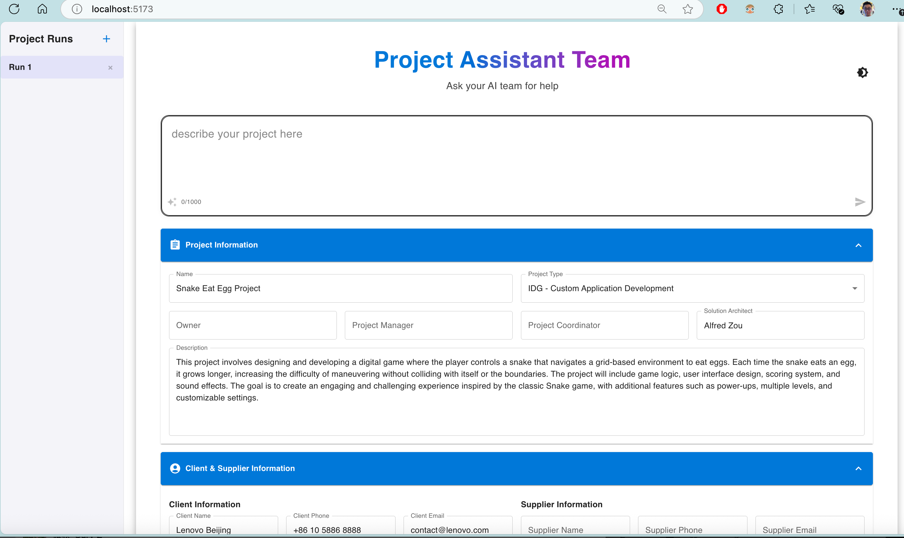

# Project Management Agents



## Project Overview

Project Management Agents is a multi-agent system designed to automate project management tasks. It transforms user-provided project descriptions into actionable tasks, assigns resources, generates project plans and Gantt charts, and produces project SOWs (Statements of Work). The system leverages AI and modular architecture to streamline complex project management scenarios.

**Key Goals:**
- Automate task creation, resource assignment, and plan generation.
- Generate project SOWs and Gantt charts from user input.
- Provide a user-friendly interface for project input and output visualization.

**User Experience:**
- Intuitive frontend for entering project descriptions.
- Easy access to generated plans, charts, and documents.

---

## System Architecture

The system is built with a modular, event-driven architecture, integrating AI services and plugins for enhanced automation.

**Main Components:**
- **Backend (Python):**
  - `backend/src/main.py`: Initializes the project, integrates plugins, and manages Azure AI services.
  - **Plugins:** Extend functionality for diagram generation, SOW creation, and resource management.
    - `mermaid_plugin.py`: Generates Mermaid diagrams and Gantt charts.
    - `sow_plugin.py`: Produces SOW documents using AI and MailMerge.
    - `resource_mcp.py`: Manages project resources via FastMCP.
    - `sow_mcp_agent.py`: Handles SOW documents with Semantic Kernel MCP.
  - **Processes:**
    - `project_kick_start_process.py`: Orchestrates the project lifecycle with event-driven steps.

- **Frontend (React + Vite):**
  - Provides a user interface for project input and output visualization.
  - Communicates with backend APIs for data exchange.

**Architectural Patterns:**
- Modular design for separation of concerns and maintainability.
- Event-driven processes for flexible workflow management.
- AI integration for automating diagram and document generation.

---

## Tech Stack

- **Languages:** Python (backend), JavaScript/React (frontend)
- **Frameworks/Libraries:** Semantic Kernel, FastMCP, MailMerge, Vite, React
- **AI Services:** Azure OpenAI (for diagram and document generation)
- **Other Tools:** dotenv (env management), RichHandler (logging), Git (version control)

**Key Dependencies:**
- Python: `dotenv`, `openai`, `semantic_kernel`, `fastmcp`, `mailmerge`
- Node.js: See `frontend/package.json` for frontend dependencies

---

## Deployment Guide

### Prerequisites

- Python 3.8+
- Node.js (for frontend)
- Azure OpenAI API credentials (for AI features)

### Setup

1. **Clone the repository:**
   ```sh
   git clone <repo-url>
   cd ProjectManagementAgents
   ```

2. **Backend Setup:**
   - Create a `backend/.env` file (see `backend/.env.example` for required variables).
   - Install Python dependencies:
     ```sh
     pip install -r backend/requirements.txt
     ```

3. **Frontend Setup:**
   - Navigate to the frontend directory:
     ```sh
     cd frontend
     ```
   - Install Node.js dependencies:
     ```sh
     npm install
     ```

---

## Startup Commands

**Backend:**
```sh
python backend/src/api.py
```

**Frontend (in `frontend/` directory):**
```sh
npm run dev
```

---

## Example Output

The system generates detailed task lists and Gantt charts for projects. Example output for a "SnakeEatEggsGameProject":

### Project Description
- **Project Name:** SnakeEatEggsGameProject
- **Description:** This project is about creating a snake eat eggs game, encompassing aspects of game design, mechanics development, asset creation, integration, testing, and refinement. The project is a software development endeavor scheduled to span from May 8, 2024, to July 8, 2024.

### Task List Table

| id       | name                      | description                                                                 | outline_level | dependent_tasks    | parent_task | child_tasks        | status              | estimated_effort_in_hours |
|----------|---------------------------|-----------------------------------------------------------------------------|---------------|--------------------|-------------|--------------------|---------------------|----------------------------|
| task_1   | Game Design Document Creation | Create a comprehensive game design document outlining gameplay mechanics, rules, and objectives. | 1             | null               | null        | task_2, task_3    | Initial planning phase | 20                      |
| task_2   | Game Mechanics Design      | Design the core mechanics of the snake and egg interaction.                | 2             | task_1             | task_1      | null              | Detailed mechanics design | 30                      |
| task_3   | Game Art Design            | Create the visual assets for the game, including the snake, eggs, and background. | 2          | task_1             | task_1      | task_4            | Art asset creation  | 40                      |
| task_4   | Animation Development      | Develop animations for the snake and egg interactions.                     | 3             | task_3             | task_3      | null              | Animation creation  | 25                      |
| task_5a  | Game Mechanics Integration | Integrate the designed game mechanics into the game engine.                | 1             | task_2             | null        | null              | Mechanics integration phase | 25                      |
| task_5b  | Visual Asset Integration   | Integrate the visual assets and animations into the game engine.           | 1             | task_3, task_4     | null        | null              | Asset integration phase | 25                      |
| task_6   | Collision Detection Implementation | Develop the collision detection system for the snake and eggs.           | 1             | task_5a            | null        | null              | Collision system development | 20                      |
| task_7   | Score and Level System     | Implement the scoring and level progression system.                        | 1             | task_5a            | null        | null              | Scoring system development | 30                      |
| task_8a  | Unit Testing               | Perform unit testing on individual components of the game.                 | 1             | task_5a, task_5b   | null        | null              | Component testing phase | 15                      |
| task_8b  | Integration Testing        | Test the integration of game mechanics and visual assets.                  | 1             | task_8a            | null        | null              | System integration testing | 15                      |
| task_8c  | User Acceptance Testing    | Conduct user acceptance testing to ensure gameplay meets expectations.     | 1             | task_8b            | null        | null              | Gameplay validation | 10                      |

### Task Gantt Diagram

```mermaid
gantt
    dateFormat  YYYY-MM-DD
    title       SnakeEatEggs Game Development Timeline
    excludes    weekends
    
    section Design Phase
    Game Design Document Creation :done, task_1, 2024-05-08, 4d
    Game Mechanics Design         :done, task_2, after task_1, 6d
    Game Art Design               :done, task_3, after task_1, 8d
    Animation Development         :done, task_4, after task_3, 5d

    section Integration Phase
    Game Mechanics Integration    :active, task_5a, after task_2, 6d
    Visual Asset Integration      :active, task_5b, after task_3 task_4, 8d
    
    section Development Phase
    Collision Detection Implementation :task_6, after task_5a, 5d
    Score and Level System             :task_7, after task_5a, 6d

    section Testing Phase
    Unit Testing                  :task_8a, after task_5a task_5b, 3d
    Integration Testing           :task_8b, after task_8a, 3d
    User Acceptance Testing       :task_8c, after task_8b, 2d
