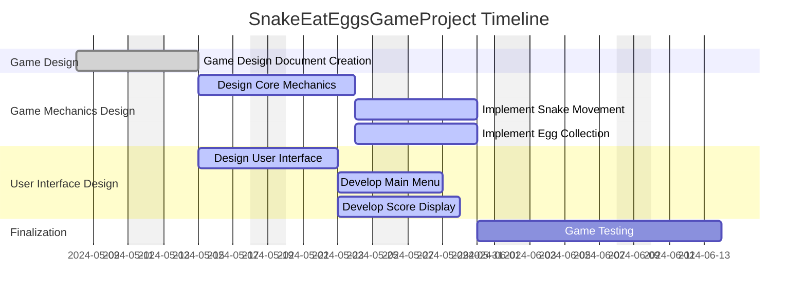

# Project Overview

## Project Name: SnakeEatEggsGameProject

**Project Description:**  
The SnakeEatEggs game project revolves around creating a dynamic and engaging game where players control a snake to navigate a play area, collect eggs, and achieve high scores. The game will include well-designed gameplay mechanics, an intuitive user interface, and thorough testing to ensure a seamless user experience.

---

# Task List Table

| **ID**       | **Name**                     | **Description**                                                               | **Outline Level** | **Dependent Tasks**             | **Parent Task** | **Child Tasks**          | **Status**      | **Estimated Effort (Hours)** |
|--------------|------------------------------|-------------------------------------------------------------------------------|-------------------|---------------------------------|-----------------|-------------------------|-----------------|------------------------------|
| task_1       | Game Design Document Creation | Create a comprehensive game design document outlining gameplay mechanics, objectives, and user interface. | 1                 | None                            | None            | task_2, task_3          | Initial design phase | 20.0                        |
| task_2       | Game Mechanics Design        | Design the core mechanics of the snake movement and egg collection.          | 2                 | task_1                         | task_1          | task_4, task_5          | Detailed mechanics design | 30.0                        |
| task_3       | User Interface Design        | Design the user interface including menus, score display, and game over screen. | 2              | task_1                         | task_1          | task_6, task_7          | UI design phase | 25.0                        |
| task_4       | Implement Snake Movement     | Develop the snake movement mechanics as per the design.                      | 3                 | task_2                         | task_2          | None                    | Development phase | 20.0                        |
| task_5       | Implement Egg Collection     | Develop the egg collection mechanics as per the design.                      | 3                 | task_2                         | task_2          | None                    | Development phase | 20.0                        |
| task_6       | Develop Main Menu            | Create the main menu interface for the game.                                 | 3                 | task_3                         | task_3          | None                    | Development phase | 15.0                        |
| task_7       | Develop Score Display        | Create the score display interface for the game.                             | 3                 | task_3                         | task_3          | None                    | Development phase | 20.0                        |
| task_8       | Game Testing                 | Test the game for bugs, gameplay issues, and user experience.                | 1                 | task_4, task_5, task_6, task_7 | None            | None                    | Testing phase | 30.0                        |

---

# Task Gantt Diagram

This structure provides a clear project roadmap, highlighting task dependencies, outline levels, estimated effort, and the overall timeline using a Gantt chart.