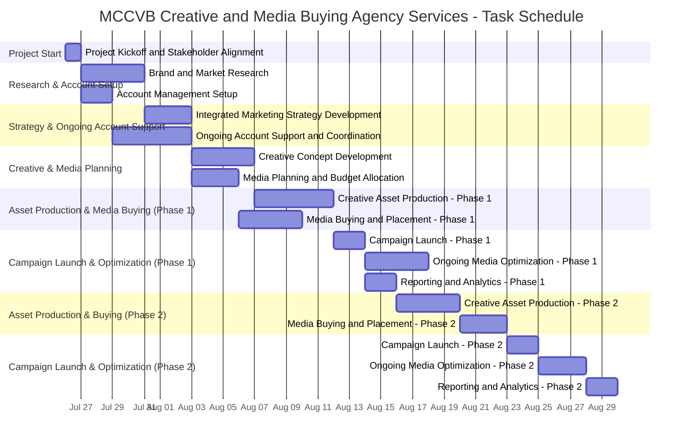

# Project Documentation

## Project Description

**Project Name:** MCCVB Creative and Media Buying Agency Services  
**Customer:** Monterey County Convention & Visitors Bureau (MCCVB)  
**Project Duration:** July 26, 2021 – June 30, 2022 (with possible extensions)  
**Project Type:** IDG - Agency Services  
**Project Overview:**  
The Monterey County Convention & Visitors Bureau (MCCVB) seeks a full-service agency to serve as agency of record, providing creative and media buying services to develop the Monterey County brand and promote tourism. The agency will collaborate with the MCCVB Marketing Communications team to plan, develop, and execute integrated marketing programs across Paid, Earned, and Owned channels. The scope includes strategy, creative development, media planning and buying, content planning, reporting and analytics, research, and account support. The primary goals are to drive overnight visitation and reinforce Monterey County as a premier tourism destination.

---

## Task List Table

| id  | name                                              | description                                                                                                                                   | outline_level | dependent_tasks   | parent_task | child_tasks      | estimated_effort_in_hours | status       | required_skills                        | assigned_to                     |
|-----|---------------------------------------------------|-----------------------------------------------------------------------------------------------------------------------------------------------|---------------|-------------------|-------------|------------------|--------------------------|-------------|-----------------------------------------|----------------------------------|
| 1   | Project Kickoff and Stakeholder Alignment         | Conduct a project kickoff meeting with MCCVB stakeholders… Distribute meeting minutes.                                                        | 1             |                   |             | 2, 3             | 8.0                      | Not Started | Project Management, Facilitation        | Senior Project Manager           |
| 2   | Brand and Market Research                        | Conduct research to understand… and tourism trends. Gather insights from stakeholders and data.                                               | 2             | 1                 | 1           | 4                | 32.0                     | Not Started | Market Research, Data Analysis          | Market Research Analyst          |
| 3   | Account Management Setup                         | Establish account management processes… define reporting cadence with MCCVB.                                                                  | 2             | 1                 | 1           | 5                | 12.0                     | Not Started | Account Management, Project Coordination| Account Manager                  |
| 4   | Integrated Marketing Strategy Development        | Develop an integrated marketing strategy based on research findings… and KPIs.                                                                | 3             | 2                 | 2           | 6, 7             | 24.0                     | Not Started | Marketing Strategy, Tourism Marketing   | Marketing Strategist             |
| 5   | Ongoing Account Support and Coordination         | Provide ongoing account support… coordinate between MCCVB and agency teams.                                                                   | 3             | 3                 | 3           |                  | 40.0                     | Not Started | Account Management, Project Coordination| Account Manager                  |
| 6   | Creative Concept Development                     | Develop creative concepts and campaign ideas… Present concepts to MCCVB for approval.                                                         | 4             | 4                 | 4           | 8                | 32.0                     | Not Started | Creative Direction, Copywriting, Design | Creative Director                |
| 7   | Media Planning and Budget Allocation             | Develop a detailed media plan, including… and budget allocation.                                                                              | 4             | 4                 | 4           | 9                | 24.0                     | Not Started | Media Planning, Budgeting               | Media Planner                    |
| 8   | Creative Asset Production - Phase 1              | Produce creative assets (copy, design, video, digital, print)…                                                                                | 5             | 6                 | 6           | 10               | 40.0                     | Not Started | Graphic Design, Copywriting, Video Prod | Creative Asset Team               |
| 9   | Media Buying and Placement - Phase 1             | Negotiate, purchase, and place media buys… for the initial campaign period.                                                                   | 5             | 7                 | 7           | 11               | 32.0                     | Not Started | Media Buying, Negotiation               | Media Buyer                      |
| 10  | Campaign Launch - Phase 1                        | Launch the initial campaign across channels… ensure all assets are live as planned.                                                           | 6             | 8, 9              | 8           | 12               | 16.0                     | Not Started | Campaign Management                     | Campaign Manager                 |
| 11  | Ongoing Media Optimization - Phase 1             | Monitor campaign performance, optimize media placements, and adjust creative…                                                                 | 6             | 10                | 9           |                  | 32.0                     | Not Started | Media Optimization, Analytics           | Media Optimization Specialist    |
| 12  | Reporting and Analytics - Phase 1                | Collect and analyze campaign data, prepare performance reports… for the first campaign phase.                                                 | 7             | 10                | 10          | 13               | 16.0                     | Not Started | Analytics, Reporting                    | Analytics & Reporting Specialist |
| 13  | Creative Asset Production - Phase 2              | Produce additional creative assets for subsequent campaign flights or optimizations…                                                          | 8             | 12                | 12          | 14               | 32.0                     | Not Started | Graphic Design, Copywriting, Video Prod | Creative Asset Team              |
| 14  | Media Buying and Placement - Phase 2             | Negotiate, purchase, and place additional media buys…                                                                                         | 9             | 13                | 13          | 15               | 24.0                     | Not Started | Media Buying, Negotiation               | Media Buyer                      |
| 15  | Campaign Launch - Phase 2                        | Launch the next phase of the campaign with new creative and media placements…                                                                 | 10            | 13, 14            | 14          | 16               | 16.0                     | Not Started | Campaign Management                     | Campaign Manager                 |
| 16  | Ongoing Media Optimization - Phase 2             | Monitor and optimize media placements and creative during the second campaign phase…                                                          | 11            | 15                | 15          |                  | 24.0                     | Not Started | Media Optimization, Analytics           | Media Optimization Specialist    |
| 17  | Reporting and Analytics - Phase 2                | Collect and analyze campaign data… present insights and recommendations…                                                                      | 12            | 16                | 15          |                  | 16.0                     | Not Started | Analytics, Reporting                    | Analytics & Reporting Specialist |

---

## Task Gantt Diagram

---

**Notes:**
- Task dependencies are based on the "dependent_task" and hierarchy from the outline_level/parent_task/child_tasks fields.
- The Gantt chart now uses days for durations and clarifies dependencies, especially for tasks with multiple predecessors (e.g., `after 8,9`).
- Adjust start dates/times and durations as needed based on your actual schedule and project management practices.
