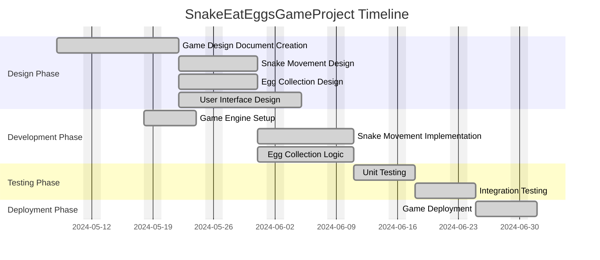

# SnakeEatEggsGameProject

## Project Description
The **SnakeEatEggsGameProject** is a software development initiative focused on creating a snake game where the player controls a snake to eat eggs while avoiding obstacles and growing in size. The game incorporates mechanics for movement, scoring, and a visually engaging user interface, along with robust testing and deployment to ensure an optimal user experience.

---

## Task List Table

| id        | name                         | description                                                                                   | outline_level | dependent_tasks      | parent_task | child_tasks         | status       | estimated_effort_in_hours |
|-----------|------------------------------|-----------------------------------------------------------------------------------------------|---------------|----------------------|-------------|---------------------|--------------|--------------------------|
| task_1    | Game Design Document Creation | Create a comprehensive game design document outlining the gameplay mechanics, objectives, and user interface. | 1             | N/A                  | N/A         | task_2, task_3, task_4 | Not Started | 20                      |
| task_2    | Snake Movement Design        | Design the movement mechanics for the snake, including controls and behavior.                 | 2             | N/A                  | task_1      | N/A                 | Not Started  | 15                      |
| task_3    | Egg Collection Design        | Design the mechanics for egg collection and scoring.                                          | 2             | N/A                  | task_1      | N/A                 | Not Started  | 15                      |
| task_4    | User Interface Design        | Design the user interface elements such as menus, score display, and game over screen.        | 2             | N/A                  | task_1      | N/A                 | Not Started  | 25                      |
| task_5    | Game Engine Setup            | Set up the game engine and configure the development environment.                             | 1             | N/A                  | N/A         | task_6, task_7      | Not Started  | 15                      |
| task_6    | Snake Movement Implementation | Implement the snake's movement logic within the game engine.                                  | 2             | task_2               | task_5      | N/A                 | Not Started  | 20                      |
| task_7    | Egg Collection Logic         | Develop the logic for egg collection and scoring.                                             | 2             | task_3               | task_5      | N/A                 | Not Started  | 20                      |
| task_8    | Unit Testing                 | Perform unit testing on individual game components to ensure functionality.                   | 1             | task_6, task_7       | N/A         | N/A                 | Not Started  | 15                      |
| task_9    | Integration Testing          | Conduct integration testing to verify the interaction between game components.                | 1             | task_8               | N/A         | N/A                 | Not Started  | 15                      |
| task_10   | Game Deployment              | Deploy the game to the target platform and ensure it is accessible to users.                  | 1             | task_9               | N/A         | N/A                 | Not Started  | 15                      |

---

## Task Gantt Diagram

