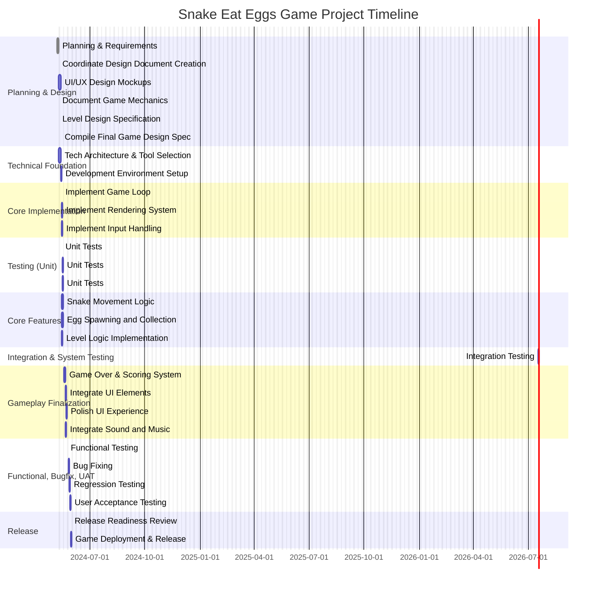

# Project Description

**Project Name:** SnakeEatEggsGameProject

**Description:**  
This project is about creating a Snake Eat Eggs Game. The aim is to design and develop a game where the player controls a snake that moves around the game area, eating eggs to score points and grow longer, while avoiding obstacles and itself. The project involves all phases from requirements gathering, design, architecture, implementation, testing, release, and deployment.

---

# Task List Table

| id       | name                                | description                                                                                                                                                                  | outline_level | dependent_tasks                               | parent_task | child_tasks        | status      | estimated_effort_in_hours |
|----------|-------------------------------------|------------------------------------------------------------------------------------------------------------------------------------------------------------------------------|---------------|------------------------------------------------|-------------|--------------------|-------------|--------------------------|
| task_1   | Project Planning and Requirements Gathering | Define the game requirements, features, and create a project plan for the Snake Eat Eggs Game.                                         | 1             | []                                             | null        | [task_2a, task_3]  | Not Started | 16.0                     |
| task_2a  | Coordinate Design Document Creation | Coordinate the creation of UI/UX, game mechanics, and level design documents.                                                          | 2             | [task_1]                                      | task_1      | [task_4, task_5, task_17] | Not Started | 2.0                      |
| task_4   | Produce UI/UX Design Mockups        | Create visual mockups and interactive prototypes for the game's user interface and user experience.                                     | 3             | [task_2a]                                     | task_2a     | []                 | Not Started | 12.0                     |
| task_5   | Document Game Mechanics             | Produce a document outlining the core game mechanics, including snake movement, egg spawning, scoring, and game over conditions.        | 3             | [task_2a]                                     | task_2a     | []                 | Not Started | 8.0                      |
| task_17  | Level Design Specification          | Define and document the level design, including layouts, difficulty progression, and special features for each level.                   | 3             | [task_2a]                                     | task_2a     | []                 | Not Started | 8.0                      |
| task_2b  | Compile Final Game Design Specification | Compile all design documents (UI/UX, mechanics, level design) into a comprehensive game design specification.                     | 2             | [task_4, task_5, task_17]                    | null        | []                 | Not Started | 2.0                      |
| task_3   | Technical Architecture and Tool Selection | Define the technical architecture, select the game engine, programming language, and supporting tools for development.                | 2             | [task_1]                                      | task_1      | [task_6]           | Not Started | 16.0                     |
| task_6   | Development Environment Setup       | Set up the development environment, including installing the game engine, libraries, and version control system.                        | 3             | [task_3]                                      | task_3      | []                 | Not Started | 8.0                      |
| task_18  | Implement Game Loop                 | Implement the main game loop to handle frame updates and timing.                                                                       | 1             | [task_6]                                      | null        | []                 | Not Started | 8.0                      |
| task_19  | Implement Rendering System          | Implement the rendering system to display game objects, backgrounds, and UI elements.                                                  | 1             | [task_6]                                      | null        | []                 | Not Started | 12.0                     |
| task_20  | Implement Input Handling            | Implement the input handling system to process player controls and actions.                                                            | 1             | [task_6]                                      | null        | []                 | Not Started | 12.0                     |
| task_27a | Write Unit Tests for Game Loop      | Write unit tests for the game loop component after its implementation.                                                                 | 2             | [task_18]                                     | null        | []                 | Not Started | 2.0                      |
| task_27b | Write Unit Tests for Rendering System | Write unit tests for the rendering system after its implementation.                                                                 | 2             | [task_19]                                     | null        | []                 | Not Started | 3.0                      |
| task_27c | Write Unit Tests for Input Handling | Write unit tests for the input handling system after its implementation.                                                               | 2             | [task_20]                                     | null        | []                 | Not Started | 3.0                      |
| task_8   | Implement Snake Movement            | Implement the logic for snake movement, direction changes, and collision detection.                                                    | 1             | [task_18, task_19, task_20, task_5]           | null        | []                 | Not Started | 16.0                     |
| task_9   | Implement Egg Spawning and Collection | Implement the logic for spawning eggs, detecting when the snake eats an egg, and updating the score.                                | 1             | [task_18, task_19, task_20, task_5]           | null        | []                 | Not Started | 12.0                     |
| task_21  | Implement Level Logic               | Implement the logic for level progression, layouts, and special features as defined in the level design specification.                 | 1             | [task_18, task_19, task_20, task_17]          | null        | []                 | Not Started | 8.0                      |
| task_28  | Execute Integration Testing         | Execute integration tests to verify that game components work together as expected.                                                    | 1             | [task_8, task_9, task_21, task_27a, task_27b, task_27c] | null        | []        | Not Started | 8.0                      |
| task_10  | Implement Game Over and Scoring System | Implement the game over conditions and scoring system, including UI updates and feedback to the player.                          | 1             | [task_8, task_9]                              | null        | []                 | Not Started | 12.0                     |
| task_22  | Integrate UI Elements               | Integrate UI elements such as menus, score display, and game over screens into the game.                                              | 1             | [task_10, task_4]                             | null        | []                 | Not Started | 8.0                      |
| task_23  | Polish UI for User Experience       | Refine and polish the UI for a better user experience, including animations, transitions, and visual feedback.                        | 1             | [task_22]                                     | null        | []                 | Not Started | 8.0                      |
| task_12  | Integrate Sound and Music           | Add sound effects and background music to enhance the gaming experience.                                                               | 1             | [task_10]                                     | null        | []                 | Not Started | 8.0                      |
| task_24  | Conduct Functional Testing          | Conduct functional testing to verify that all game features work as intended.                                                          | 1             | [task_23, task_12, task_21, task_8, task_9, task_10]     | null        | []        | Not Started | 8.0                      |
| task_25  | Conduct Bug Fixing                  | Identify and fix bugs found during functional testing.                                                                                 | 1             | [task_24]                                     | null        | []                 | Not Started | 8.0                      |
| task_26  | Conduct Regression Testing          | Conduct regression testing to ensure that bug fixes have not introduced new issues.                                                    | 1             | [task_25]                                     | null        | []                 | Not Started | 8.0                      |
| task_29  | Conduct User Acceptance Testing     | Conduct user acceptance testing with a sample of target users and gather feedback, including both internal and external user acceptance.| 1             | [task_26]                                     | null        | []                 | Not Started | 12.0                     |
| task_30  | Release Readiness Review            | Conduct a final review to ensure the game is ready for deployment, including sign-off from stakeholders.                              | 1             | [task_29]                                     | null        | []                 | Not Started | 2.0                      |
| task_16  | Game Deployment and Release         | Package the game and deploy it to the target platform(s). Prepare release notes and documentation.                                     | 1             | [task_30]                                     | null        | []                 | Not Started | 8.0                      |

---

# Task Gantt Diagram

---

**Note:** The durations are approximated in calendar days based on 8-hour days and dependencies. Actual schedule will require refinement considering realistic work schedules, resource allocation, and availability.