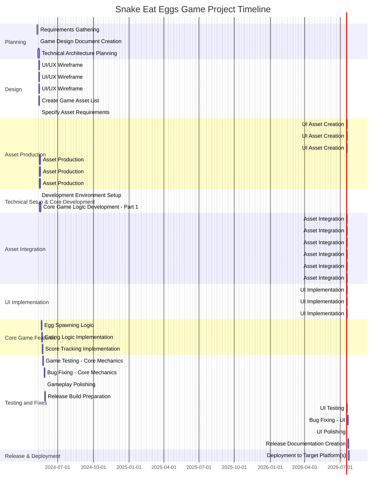

# Project Description

**Project Name:** SnakeEatEggsGameProject

**Description:**  
This project focuses on the development of a "Snake Eat Eggs" game—a digital game wherein players control a snake that must consume eggs to score points and grow in size. The project includes work across requirements gathering, game design, UI/UX, asset creation/integration, development, testing, bug fixing, polishing, release, and deployment. The game will target platforms as specified during requirements gathering.

---

# Task List Table

| id   | name                                   | description                                                                                         | outline_level | dependent_tasks       | parent_task | child_tasks          | estimated_effort_in_hours | status       | required_skills                   |
|------|----------------------------------------|-----------------------------------------------------------------------------------------------------|---------------|----------------------|-------------|---------------------|---------------------------|-------------|------------------------------------|
| 1    | Requirements Gathering                 | Collect and document all requirements for the Snake Eat Eggs game.                                   | 1             |                      |             | 2, 3                | 16.0                      | Not Started | Requirements Analysis              |
| 2    | Game Design Document Creation          | Create a detailed game design document. (Summary task, no direct effort)                             | 2             | 1                    | 1           | 4a, 4b, 4c, 5a, 5b  | 0.0                       | Not Started |                                    |
| 3    | Technical Architecture Planning        | Define the technical architecture.                                                                  | 2             | 1                    | 1           | 6                   | 16.0                      | Not Started | Software Architecture              |
| 4a   | UI/UX Wireframe Design: Main Menu      | Design wireframes for the main menu screen.                                                          | 3             | 2                    | 2           | 7a                  | 6.0                       | Not Started | UI Design, UX Design               |
| 4b   | UI/UX Wireframe Design: Settings Screen| Design wireframes for the settings screen.                                                           | 3             | 2                    | 2           | 7b                  | 7.0                       | Not Started | UI Design, UX Design               |
| 4c   | UI/UX Wireframe Design: In-Game UI     | Design wireframes for the in-game UI                                                                 | 3             | 2                    | 2           | 7c                  | 7.0                       | Not Started | UI Design, UX Design               |
| 5a   | Create Game Asset List                 | List all required game assets.                                                                      | 3             | 2                    | 2           |                     | 4.0                       | Not Started | Game Design                        |
| 5b   | Specify Asset Requirements             | Define technical & artistic requirements for each asset.                                            | 3             | 5a                   | 2           | 8a, 8b, 8c          | 4.0                       | Not Started | Game Design                        |
| 6    | Development Environment Setup          | Set up the development environment.                                                                 | 3             | 3                    | 3           | 9, 10a, 10b         | 8.0                       | Not Started | DevOps, Software Setup             |
| 7a   | UI Asset Creation: Main Menu           | Create main menu graphical assets.                                                                  | 4             | 4a                   | 4a          | 11a                 | 4.0                       | Not Started | Graphic Design                      |
| 7b   | UI Asset Creation: Settings Screen     | Create settings screen graphical assets.                                                            | 4             | 4b                   | 4b          | 11b                 | 4.0                       | Not Started | Graphic Design                      |
| 7c   | UI Asset Creation: In-Game UI          | Create in-game UI graphical assets.                                                                 | 4             | 4c                   | 4c          | 11c                 | 4.0                       | Not Started | Graphic Design                      |
| 8a   | Asset Production: Sprites              | Create all sprite assets for the game.                                                              | 4             | 5a,5b                | 5b          | 12a                 | 12.0                      | Not Started | 2D Art                             |
| 8b   | Asset Production: Backgrounds          | Create background assets.                                                                           | 4             | 5a,5b                | 5b          | 12b                 | 10.0                      | Not Started | 2D Art                             |
| 8c   | Asset Production: Sound Effects        | Produce sound effects for the game.                                                                 | 4             | 5a,5b                | 5b          | 12c                 | 10.0                      | Not Started | Sound Design                        |
| 9    | Core Game Logic Development - Part 1   | Implement basic snake movement & collision detection.                                               | 4             | 6                    | 6           | 13a                 | 24.0                      | Not Started | Game Programming                    |
| 10a  | UI Implementation: Main Menu           | Implement main menu screen with integrated UI assets.                                               | 4             | 6,11a                | 6           |                     | 8.0                       | Not Started | UI Development                      |
| 10b  | UI Implementation: Settings Screen     | Implement the settings screen with integrated UI assets.                                            | 4             | 6,11b                | 6           |                     | 8.0                       | Not Started | UI Development                      |
| 11a  | Asset Integration: UI (Main Menu)      | Integrate main menu UI assets into the engine.                                                      | 5             | 7a                   | 7a          | 10a                 | 2.0                       | Not Started | UI Development                      |
| 11b  | Asset Integration: UI (Settings)       | Integrate settings screen UI assets into the engine.                                                | 5             | 7b                   | 7b          | 10b                 | 2.0                       | Not Started | UI Development                      |
| 11c  | Asset Integration: UI (In-Game UI)     | Integrate in-game UI assets into the engine.                                                        | 5             | 7c                   | 7c          | 14                  | 2.0                       | Not Started | UI Development                      |
| 12a  | Asset Integration: Sprites             | Integrate sprite assets into the game engine.                                                       | 5             | 8a                   | 8a          | 13a                 | 3.0                       | Not Started | Game Programming                    |
| 12b  | Asset Integration: Backgrounds         | Integrate background assets into the game engine.                                                   | 5             | 8b                   | 8b          | 13a                 | 3.0                       | Not Started | Game Programming                    |
| 12c  | Asset Integration: Sound Effects       | Integrate sound effects into the engine.                                                            | 5             | 8c                   | 8c          | 13c                 | 2.0                       | Not Started | Game Programming                    |
| 13a  | Egg Spawning Logic                     | Implement logic for egg spawning at random positions.                                               | 5             | 9,12a,12b            | 9           | 13b                 | 8.0                       | Not Started | Game Programming                    |
| 13b  | Eating Logic Implementation            | Snake eats eggs and grows.                                                                         | 6             | 13a                  | 13a         | 13c                 | 8.0                       | Not Started | Game Programming                    |
| 13c  | Score Tracking Implementation          | Implement score tracking and scoring sound feedback.                                                | 7             | 13b,12c              | 13b         | 15                  | 8.0                       | Not Started | Game Programming                    |
| 14   | UI Implementation: In-Game UI          | Implement in-game UI (score, lives, pause, etc.)                                                   | 5             | 11c                  | 10b         | 16                  | 8.0                       | Not Started | UI Development                      |
| 15   | Game Testing - Core Mechanics          | Test core mechanics for bugs.                                                                      | 8             | 13c                  | 13c         | 17a                 | 16.0                      | Not Started | Game Testing                        |
| 16   | UI Testing                             | Test all UI screens and in-game UI for usability and bugs.                                          | 6             | 14                   | 14          | 17b                 | 8.0                       | Not Started | UI Testing                          |
| 17a  | Bug Fixing - Core Mechanics            | Fix bugs found in core mechanics.                                                                  | 9             | 15                   | 15          | 17c                 | 8.0                       | Not Started | Game Programming                    |
| 17b  | Bug Fixing - UI                        | Fix bugs found in UI.                                                                              | 7             | 16                   | 16          | 17d                 | 6.0                       | Not Started | UI Development                      |
| 17c  | Gameplay Polishing                     | Final polishing of gameplay based on feedback.                                                     | 10            | 17a                  |             | 18a                 | 5.0                       | Not Started | Game Programming                    |
| 17d  | UI Polishing                           | Final UI polish based on feedback.                                                                 | 10            | 17b                  |             | 18b                 | 5.0                       | Not Started | UI Development                      |
| 18a  | Release Build Preparation               | Prepare release build of the game.                                                                 | 11            | 17c                  | 17c         |                     | 3.0                       | Not Started | Release Management                  |
| 18b  | Release Documentation Creation          | Create release notes and user guides.                                                              | 11            | 17d                  | 17d         |                     | 3.0                       | Not Started | Documentation                       |
| 18c  | Deployment to Target Platform(s)        | Deploy the game to the target platforms.                                                           | 11            | 18a,18b              |             |                     | 2.0                       | Not Started | Release Management                  |

---

# Task Gantt Diagram

---

**Note**:  
- Task durations are based on their estimated effort, proportionally mapped to project days for visual clarity.  
- Actual dependencies and sequencing should be further refined during project planning and team allocation.

