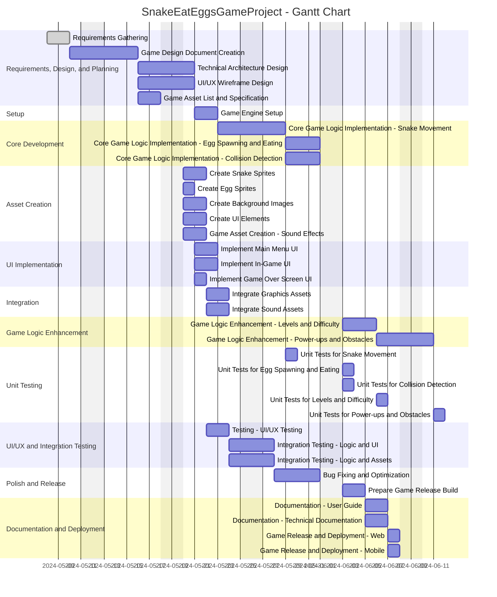

# Project Description

**Project Name:** SnakeEatEggsGameProject

**Description:**  
This project focuses on the development of a "Snake Eat Eggs" game. The objective is to deliver a complete gaming experience, from initial requirements gathering and design, through technical architecture and development, up to testing, documentation, and deployment on web and mobile platforms. The approach will include clear documentation, thorough asset creation, solid game logic, and comprehensive testing for a robust final product.

---

# Task List Table

| id   | name                                              | description                                                                                 | outline_level | dependent_tasks              | parent_task | child_tasks | estimated_effort_in_hours | status       | required_skills                          |
|------|---------------------------------------------------|---------------------------------------------------------------------------------------------|---------------|-----------------------------|-------------|-------------|--------------------------|--------------|-------------------------------------------|
| 1    | Requirements Gathering                            | Collect and document all requirements for the Snake Eat Eggs game, including gameplay mechanics, platform, and user experience. | 1             | -                           | -           | -           | 8.0                      | Not Started  | requirements analysis                     |
| 2    | Game Design Document Creation                     | Create a detailed game design document outlining game rules, UI/UX, levels, scoring, and assets required. | 1             | 1                           | -           | -           | 16.0                     | Not Started  | game design, documentation                |
| 3    | Technical Architecture Design                     | Design the technical architecture, including game engine selection, technology stack, and system components. | 1             | 2                           | -           | -           | 12.0                     | Not Started  | software architecture                     |
| 4    | UI/UX Wireframe Design                            | Create wireframes for the game's user interface and user experience flows.                   | 1             | 2                           | -           | -           | 12.0                     | Not Started  | UI/UX design                             |
| 5    | Game Asset List and Specification                 | List and specify all required game assets (sprites, backgrounds, sounds, etc.) for the Snake Eat Eggs game. | 1             | 2                           | -           | -           | 8.0                      | Not Started  | game design                               |
| 6    | Game Engine Setup                                 | Set up the chosen game engine and configure the initial project structure.                   | 1             | 3                           | -           | -           | 8.0                      | Not Started  | game development                           |
| 7    | Core Game Logic Implementation - Snake Movement   | Implement the core logic for snake movement and controls.                                   | 1             | 6                           | -           | -           | 16.0                     | Not Started  | game development                           |
| 8    | Core Game Logic Implementation - Egg Spawning and Eating | Implement logic for spawning eggs and handling snake eating eggs.                       | 1             | 7                           | -           | -           | 12.0                     | Not Started  | game development                           |
| 9    | Core Game Logic Implementation - Collision Detection | Implement collision detection for snake with walls, itself, and eggs.                    | 1             | 7                           | -           | -           | 12.0                     | Not Started  | game development                           |
| 10a  | Create Snake Sprites                              | Design and create graphical sprites for the snake in various states.                        | 1             | 5                           | -           | -           | 6.0                      | Not Started  | graphic design                              |
| 10b  | Create Egg Sprites                                | Design and create graphical sprites for the eggs.                                           | 1             | 5                           | -           | -           | 4.0                      | Not Started  | graphic design                              |
| 10c  | Create Background Images                          | Design and create background images for the game scenes.                                    | 1             | 5                           | -           | -           | 8.0                      | Not Started  | graphic design                              |
| 10d  | Create UI Elements                                | Design and create graphical assets for UI elements such as buttons, score display, and menus. | 1             | 5                           | -           | -           | 6.0                      | Not Started  | graphic design                              |
| 11   | Game Asset Creation - Sound Effects               | Create or source sound effects for the game (e.g., eating egg, game over, background music). | 1             | 5                           | -           | -           | 8.0                      | Not Started  | audio design                                |
| 12a  | Implement Main Menu UI                            | Implement the main menu user interface based on wireframes.                                 | 1             | 4,6,10d                     | -           | -           | 6.0                      | Not Started  | UI development                               |
| 12b  | Implement In-Game UI                              | Implement the in-game UI, including score, lives, and other HUD elements.                   | 1             | 4,6,10d                     | -           | -           | 6.0                      | Not Started  | UI development                               |
| 12c  | Implement Game Over Screen UI                     | Implement the game over screen UI based on wireframes.                                      | 1             | 4,6,10d                     | -           | -           | 4.0                      | Not Started  | UI development                               |
| 13   | Integrate Graphics Assets                         | Integrate created graphical assets (snake, eggs, backgrounds, UI) into the game engine.     | 1             | 10a,10b,10c,10d,7,8,9       | -           | -           | 8.0                      | Not Started  | game development                            |
| 14   | Integrate Sound Assets                            | Integrate sound effects and background music into the game.                                 | 1             | 11,7,8,9                    | -           | -           | 8.0                      | Not Started  | game development                            |
| 15   | Game Logic Enhancement - Levels and Difficulty     | Implement levels and difficulty progression in the game.                                    | 1             | 8,9                         | -           | -           | 12.0                     | Not Started  | game development                            |
| 16   | Game Logic Enhancement - Power-ups and Obstacles  | Add power-ups and obstacles to enhance gameplay.                                            | 1             | 15                          | -           | -           | 12.0                     | Not Started  | game development                            |
| 17a  | Unit Tests for Snake Movement                     | Write and execute unit tests for snake movement logic.                                      | 1             | 7                           | -           | -           | 3.0                      | Not Started  | testing                                      |
| 17b  | Unit Tests for Egg Spawning and Eating            | Write and execute unit tests for egg spawning and eating logic.                             | 1             | 8                           | -           | -           | 3.0                      | Not Started  | testing                                      |
| 17c  | Unit Tests for Collision Detection                | Write and execute unit tests for collision detection logic.                                 | 1             | 9                           | -           | -           | 3.0                      | Not Started  | testing                                      |
| 17d  | Unit Tests for Levels and Difficulty              | Write and execute unit tests for levels and difficulty progression logic.                   | 1             | 15                          | -           | -           | 2.0                      | Not Started  | testing                                      |
| 17e  | Unit Tests for Power-ups and Obstacles            | Write and execute unit tests for power-ups and obstacles logic.                             | 1             | 16                          | -           | -           | 2.0                      | Not Started  | testing                                      |
| 18   | Testing - UI/UX Testing                           | Test the user interface and user experience for usability and bugs.                         | 1             | 12a,12b,12c,13              | -           | -           | 8.0                      | Not Started  | testing                                      |
| 19a  | Integration Testing - Logic and UI                | Test the integration of game logic with UI components to ensure correct display and interaction. | 1          | 13,14,17a,17b,17c,17d,17e,18| -           | -           | 6.0                      | Not Started  | testing                                      |
| 19b  | Integration Testing - Logic and Assets            | Test the integration of game logic with graphical and sound assets for correct rendering and playback. | 1    | 13,14,17a,17b,17c,17d,17e,18| -           | -           | 6.0                      | Not Started  | testing                                      |
| 20   | Bug Fixing and Optimization                       | Fix bugs found during testing and optimize game performance.                                 | 1             | 19a,19b                     | -           | -           | 16.0                     | Not Started  | game development, debugging                 |
| 21   | Prepare Game Release Build                        | Prepare the final build of the game for release, including packaging and platform-specific adjustments. | 1    | 20                          | -           | -           | 8.0                      | Not Started  | game development                            |
| 22   | Documentation - User Guide                        | Create a user guide explaining how to play the game and its features.                       | 1             | 21                          | -           | -           | 8.0                      | Not Started  | documentation                                |
| 23   | Documentation - Technical Documentation           | Document the technical aspects of the game for future maintenance and updates.              | 1             | 21                          | -           | -           | 8.0                      | Not Started  | documentation                                |
| 24a  | Game Release and Deployment - Web                 | Release and deploy the game to web platforms.                                               | 1             | 21,22,23                    | -           | -           | 4.0                      | Not Started  | deployment                                   |
| 24b  | Game Release and Deployment - Mobile              | Release and deploy the game to mobile platforms.                                            | 1             | 21,22,23                    | -           | -           | 4.0                      | Not Started  | deployment                                   |

---

# Task Gantt Diagram

---

**Note:** Actual days and durations are illustrative based on the estimated effort and natural sequencing of dependencies. Adjustments can be made for team availability and parallel tasking as needed.