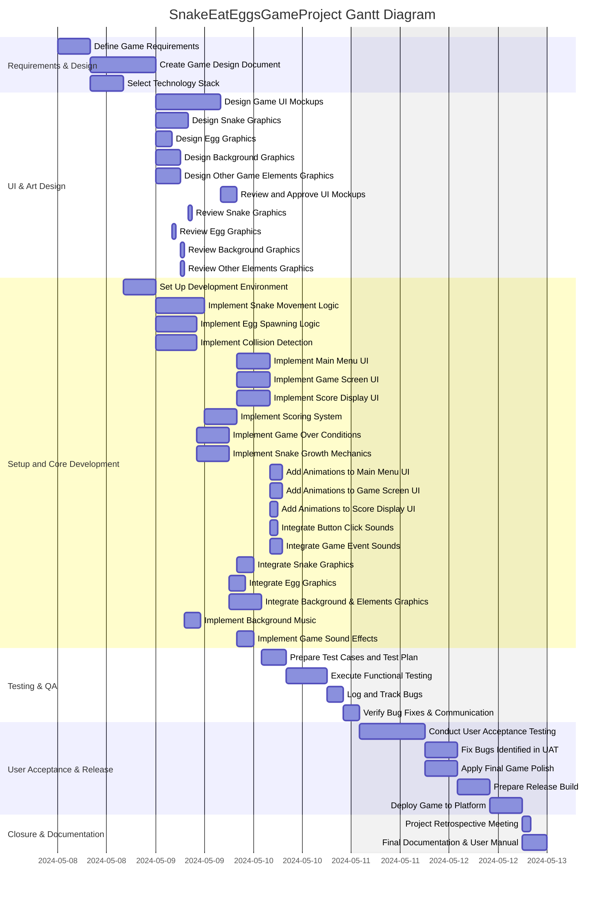

# Project Description

**Project Name:** SnakeEatEggsGameProject

**Description:**  
This project is aimed at creating an engaging "Snake Eat Eggs" game. The game project will cover all aspects from requirement gathering, design, asset creation, development, testing, user acceptance, to release and deployment. The goal is to deliver a fun, visually appealing, and well-polished game experience with sound effects, animations, robust gameplay mechanics, and thorough documentation.

---

# Task List Table

| id   | name                                      | description                                                                                                                                         | outline_level | dependent_tasks           | parent_task | child_tasks                                | estimated_effort_in_hours | status       | required_skills                        |
|------|-------------------------------------------|-----------------------------------------------------------------------------------------------------------------------------------------------------|---------------|--------------------------|-------------|--------------------------------------------|--------------------------|--------------|----------------------------------------|
| 1    | Define Game Requirements                  | Gather and document detailed requirements for the Snake Eat Eggs game, including gameplay mechanics, user interface, platforms, and technical constraints. | 1             |                          |             | 2, 3                                      | 8                        | Not Started  | Requirements Analysis                  |
| 2    | Create Game Design Document               | Develop a comprehensive game design document covering game rules, levels, scoring, controls, and visual style.                                      | 2             | 1                        | 1           | 4, 5a, 5b, 5c, 5d                         | 16                       | Not Started  | Game Design, Documentation             |
| 3    | Select Technology Stack                   | Evaluate and select the programming language, game engine, and libraries to be used for the project.                                                | 2             | 1                        | 1           | 6                                         | 8                        | Not Started  | Technical Evaluation                   |
| 4    | Design Game UI Mockups                    | Create visual mockups for the game's user interface, including menus, game screen, and score display.                                               | 3             | 2                        | 2           | 7                                         | 16                       | Not Started  | UI Design, Graphic Design              |
| 5a   | Design Snake Graphics                     | Design and create graphical assets for the snake character.                                                                                         | 3             | 2                        | 2           | 8a                                        | 8                        | Not Started  | Graphic Design, Game Art               |
| 5b   | Design Egg Graphics                       | Design and create graphical assets for the eggs in the game.                                                                                        | 3             | 2                        | 2           | 8b                                        | 4                        | Not Started  | Graphic Design, Game Art               |
| 5c   | Design Background Graphics                | Design and create the background graphics for the game environment.                                                                                 | 3             | 2                        | 2           | 8c                                        | 6                        | Not Started  | Graphic Design, Game Art               |
| 5d   | Design Other Game Elements Graphics       | Design and create graphics for other game elements (e.g., obstacles, power-ups).                                                                   | 3             | 2                        | 2           | 8d                                        | 6                        | Not Started  | Graphic Design, Game Art               |
| 6    | Set Up Development Environment            | Install and configure the selected development tools, libraries, and version control system.                                                         | 3             | 3                        | 3           | 9a, 9b, 9c, 10a, 10b, 10c                | 8                        | Not Started  | DevOps, Configuration                  |
| 7    | Review and Approve UI Mockups             | Review the UI mockups with stakeholders and obtain approval for implementation.                                                                     | 4             | 4                        | 4           |                                            | 4                        | Not Started  | UI Review, Stakeholder Management      |
| 8a   | Review and Approve Snake Graphics         | Review the created snake graphics with stakeholders and obtain approval for use in the game.                                                        | 4             | 5a                       | 5a          |                                            | 1                        | Not Started  | Art Review, Stakeholder Management     |
| 8b   | Review and Approve Egg Graphics           | Review the created egg graphics with stakeholders and obtain approval for use in the game.                                                          | 4             | 5b                       | 5b          |                                            | 1                        | Not Started  | Art Review, Stakeholder Management     |
| 8c   | Review and Approve Background Graphics    | Review the created background graphics with stakeholders and obtain approval for use in the game.                                                   | 4             | 5c                       | 5c          |                                            | 1                        | Not Started  | Art Review, Stakeholder Management     |
| 8d   | Review and Approve Other Game Elements Graphics | Review the created graphics for other game elements with stakeholders and obtain approval for use in the game.                                      | 4             | 5d                       | 5d          |                                            | 1                        | Not Started  | Art Review, Stakeholder Management     |
| 9a   | Implement Snake Movement Logic            | Develop the logic for snake movement, including direction changes and continuous movement.                                                           | 4             | 6                        | 6           | 11a                                       | 12                       | Not Started  | Programming, Game Development          |
| 9b   | Implement Egg Spawning Logic              | Develop the logic for spawning eggs at random positions on the game board.                                                                          | 4             | 6                        | 6           | 11b                                       | 10                       | Not Started  | Programming, Game Development          |
| 9c   | Implement Collision Detection             | Develop the logic for detecting collisions between the snake, eggs, and obstacles.                                                                  | 4             | 6                        | 6           | 11c                                       | 10                       | Not Started  | Programming, Game Development          |
| 10a  | Implement Main Menu UI                    | Develop the main menu user interface based on approved mockups.                                                                                      | 4             | 6, 7                     | 6           | 12a                                       | 8                        | Not Started  | UI Development, Programming            |
| 10b  | Implement Game Screen UI                  | Develop the main game screen user interface based on approved mockups.                                                                              | 4             | 6, 7                     | 6           | 12b                                       | 8                        | Not Started  | UI Development, Programming            |
| 10c  | Implement Score Display UI                | Develop the score display user interface based on approved mockups.                                                                                 | 4             | 6, 7                     | 6           | 12c                                       | 8                        | Not Started  | UI Development, Programming            |
| 11a  | Implement Scoring System                  | Develop the logic for updating and displaying the player's score when eggs are eaten.                                                               | 5             | 9a                       | 9a          | 13a                                       | 8                        | Not Started  | Programming, Game Development          |
| 11b  | Implement Game Over Conditions            | Develop the logic for determining when the game ends (e.g., snake collides with itself or wall).                                                    | 5             | 9b                       | 9b          | 13b                                       | 8                        | Not Started  | Programming, Game Development          |
| 11c  | Implement Snake Growth Mechanics          | Develop the logic for increasing the snake's length when it eats an egg.                                                                            | 5             | 9c                       | 9c          | 13c                                       | 8                        | Not Started  | Programming, Game Development          |
| 12a  | Add Animations to Main Menu UI            | Add animations and visual polish to the main menu user interface.                                                                                   | 5             | 10a, 8a                  | 10a         |                                            | 3                        | Not Started  | UI Development, Animation              |
| 12b  | Add Animations to Game Screen UI          | Add animations and visual polish to the game screen user interface.                                                                                 | 5             | 10b, 8a, 8b, 8c, 8d      | 10b         |                                            | 3                        | Not Started  | UI Development, Animation              |
| 12c  | Add Animations to Score Display UI        | Add animations and visual polish to the score display user interface.                                                                               | 5             | 10c, 8a, 8b              | 10c         |                                            | 2                        | Not Started  | UI Development, Animation              |
| 12d  | Integrate Button Click Sounds             | Integrate sound effects for button clicks in the main menu UI.                                                                                      | 5             | 10a, 8a                  |             |                                            | 2                        | Not Started  | Audio Integration                      |
| 12e  | Integrate Game Event Sounds               | Integrate sound effects for game events (e.g., eating eggs, game over) in the game screen UI.                                                       | 5             | 10b, 8a, 8b, 8c, 8d      |             |                                            | 3                        | Not Started  | Audio Integration                      |
| 13a  | Integrate Snake Graphics                  | Integrate approved snake graphics into the game logic and UI.                                                                                       | 6             | 8a, 11a                  | 11a         | 15a                                       | 4                        | Not Started  | Programming, Game Development          |
| 13b  | Integrate Egg Graphics                    | Integrate approved egg graphics into the game logic and UI.                                                                                         | 6             | 8b, 11b                  | 11b         | 15a                                       | 4                        | Not Started  | Programming, Game Development          |
| 13c  | Integrate Background and Other Elements Graphics | Integrate approved background and other game element graphics into the game logic and UI.                                                     | 6             | 8c, 8d                   | 11c         | 15a                                       | 8                        | Not Started  | Programming, Game Development          |
| 14a  | Implement Background Music                | Add background music to the game, ensuring it loops and fits the game theme.                                                                       | 7             | 8c                       |             | 15a                                       | 4                        | Not Started  | Audio Integration                      |
| 14b  | Implement Game Sound Effects              | Add sound effects for game events (e.g., eating eggs, game over, button clicks).                                                                   | 7             | 11a, 11b, 8a, 8b         |             | 15a                                       | 4                        | Not Started  | Audio Integration                      |
| 15a  | Prepare Test Cases and Test Plan          | Prepare detailed test cases and a test plan for internal QA testing.                                                                                | 8             | 13a, 13b, 13c, 14a, 14b  |             | 15b                                       | 6                        | Not Started  | Testing, Test Planning                 |
| 15b  | Execute Functional Testing                | Execute functional testing based on the test plan to identify bugs and issues.                                                                     | 9             | 15a                      | 15a         | 15c                                       | 10                       | Not Started  | Testing, Bug Tracking                  |
| 15c  | Log and Track Bugs                        | Log and track bugs found during testing.                                                                                                            | 10            | 15b                      | 15b         | 15d                                       | 4                        | Not Started  | Testing, Bug Tracking                  |
| 15d  | Verify Bug Fixes and Communicate with Developers | Verify that bugs have been fixed and communicate with developers as needed.                                                              | 11            | 15c                      | 15c         | 16                                        | 4                        | Not Started  | Testing, Communication                 |
| 16   | Conduct User Acceptance Testing           | Invite users to play the game and collect feedback to ensure it meets expectations.                                                                | 12            | 15d                      | 15d         | 17a, 17b                                  | 16                       | Not Started  | Testing, User Feedback                 |
| 17a  | Fix Bugs Identified in UAT                | Address issues found during user acceptance testing.                                                                                                | 13            | 16                       | 16          | 18                                        | 8                        | Not Started  | Programming, Debugging                 |
| 17b  | Apply Final Game Polish                   | Apply final polish to the game based on UAT feedback (e.g., minor UI tweaks, performance improvements, final balancing).                           | 13            | 16                       | 16          | 18                                        | 8                        | Not Started  | Programming, UI Development            |
| 18   | Prepare Release Build                     | Create the final release build of the game and prepare distribution packages.                                                                      | 14            | 17a, 17b                 |             | 19                                        | 8                        | Not Started  | Build Management                       |
| 19   | Deploy Game to Target Platform            | Deploy the game to the selected platform(s) (e.g., web, mobile, desktop).                                                                         | 15            | 18                       | 18          | 20a, 20b                                  | 8                        | Not Started  | Deployment, Platform Integration       |
| 20a  | Conduct Project Retrospective Meeting     | Conduct a project retrospective meeting to discuss lessons learned and process improvements.                                                        | 16            | 19                       | 19          |                                            | 2                        | Not Started  | Facilitation, Project Management       |
| 20b  | Prepare Final Project Documentation and User Manual | Prepare and deliver final project documentation and user manual for the game.                                                              | 16            | 19                       | 19          |                                            | 6                        | Not Started  | Documentation, Project Management      |

---

# Task Gantt Diagram

---

**Note:** Time estimates are represented in hours (`h`) and are sequential for clarity. Actual project scheduling would convert estimates into calendar days/weeks depending on resource allocation and concurrency potential. Please adjust start dates/timeline for actual use in a real tool.