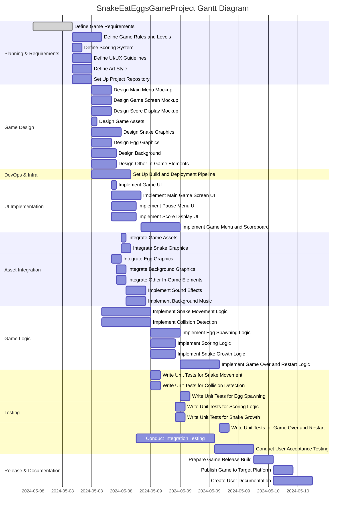

# Project Description

**Project Name**: SnakeEatEggsGameProject  
**Description**:  
This project involves the design, development, and release of a “Snake Eat Eggs” game. The game will feature classic snake gameplay with new mechanics, multiple levels, unique art styles, immersive sound effects/music, and a modern UI/UX to target web and mobile platforms. The workflow includes requirements gathering, design, implementation, asset integration, testing, documentation, and deployment.

---

# Task List Table

| id   | name                                  | description                                                                                                  | outline_level | dependent_tasks                 | parent_task | child_tasks            | estimated_effort_in_hours | status       | required_skills                                  |
|------|---------------------------------------|--------------------------------------------------------------------------------------------------------------|---------------|-------------------------------|-------------|------------------------|--------------------------|-------------|--------------------------------------------------|
| 1    | Define Game Requirements              | Gather and document detailed requirements for the Snake Eat Eggs game.                                        | 1             | []                            | null        | 2a,2b,2c,2d,3          | 8                        | Not Started | Requirements Analysis                            |
| 2a   | Define Game Rules and Levels          | Document the rules of the game and design levels.                                                            | 2             | 1                             | 1           |                        | 6                        | Not Started | Game Design                                       |
| 2b   | Define Scoring System                 | Specify the scoring system for the game.                                                                     | 2             | 1                             | 1           |                        | 2                        | Not Started | Game Design                                       |
| 2c   | Define UI/UX Guidelines               | Establish guidelines for the user interface and user experience.                                             | 2             | 1                             | 1           |                        | 4                        | Not Started | UI/UX Design                                      |
| 2d   | Define Art Style                      | Define the visual art style for the game.                                                                    | 2             | 1                             | 1           |                        | 4                        | Not Started | Art Direction                                     |
| 3    | Set Up Project Repository             | Create and configure the version control repository.                                                         | 2             | 1                             | 1           | 6                      | 4                        | Not Started | Git, DevOps                                       |
| 4a   | Design Main Menu Mockup               | Create a visual mockup for the main menu.                                                                    | 3             | 2c                            | null        |                        | 4                        | Not Started | UI Design, Figma                                  |
| 4b   | Design Game Screen Mockup             | Create a visual mockup for the main game screen.                                                             | 3             | 2c                            | null        |                        | 4                        | Not Started | UI Design, Figma                                  |
| 4c   | Design Score Display Mockup           | Create a visual mockup for the score display.                                                                | 3             | 2c                            | null        |                        | 4                        | Not Started | UI Design, Figma                                  |
| 5    | Design Game Assets                    | Oversee and coordinate the creation of graphical assets.                                                     | 2             | 2d                            | null        | 5a,5b,5c,5d            | 0                        | Not Started |                                                  |
| 5a   | Design Snake Graphics                 | Design and create snake character graphics.                                                                  | 3             | 2d                            | 5           |                        | 6                        | Not Started | 2D Art, Photoshop, Illustrator                    |
| 5b   | Design Egg Graphics                   | Design and create egg graphics.                                                                              | 3             | 2d                            | 5           |                        | 4                        | Not Started | 2D Art, Photoshop, Illustrator                    |
| 5c   | Design Background                     | Design and create the game’s background graphics.                                                            | 3             | 2d                            | 5           |                        | 5                        | Not Started | 2D Art, Photoshop, Illustrator                    |
| 5d   | Design Other In-Game Elements         | Design and create other required in-game graphics.                                                           | 3             | 2d                            | 5           |                        | 5                        | Not Started | 2D Art, Photoshop, Illustrator                    |
| 6    | Set Up Build and Deployment Pipeline  | Configure automated build and deployment pipeline.                                                           | 3             | 3                             | 3           |                        | 8                        | Not Started | CI/CD, DevOps                                     |
| 7    | Implement Game UI                     | Parent task for implementing UI components.                                                                  | 3             | 4a,4b,4c                      | null        | 7a,7b,7c               | 0                        | Not Started |                                                  |
| 7a   | Implement Main Game Screen UI         | Develop the main game screen UI.                                                                             | 4             | 4b                            | 7           |                        | 6                        | Not Started | UI Development, Game Engine                       |
| 7b   | Implement Pause Menu UI               | Develop the pause menu UI.                                                                                   | 4             | 4a                            | 7           |                        | 5                        | Not Started | UI Development, Game Engine                       |
| 7c   | Implement Score Display UI            | Develop the score display UI.                                                                                | 4             | 4c                            | 7           |                        | 5                        | Not Started | UI Development, Game Engine                       |
| 8    | Integrate Game Assets                 | Parent task for integrating graphical assets into the engine.                                                 | 3             | 5a,5b,5c,5d                   | null        | 8a,8b,8c,8d            | 0                        | Not Started |                                                  |
| 8a   | Integrate Snake Graphics              | Integrate the snake graphics into the engine.                                                                | 4             | 5a                            | 8           |                        | 2                        | Not Started | Game Engine, Asset Management                     |
| 8b   | Integrate Egg Graphics                | Integrate the egg graphics into the engine.                                                                  | 4             | 5b                            | 8           |                        | 2                        | Not Started | Game Engine, Asset Management                     |
| 8c   | Integrate Background Graphics         | Integrate the background graphics into the engine.                                                           | 4             | 5c                            | 8           |                        | 2                        | Not Started | Game Engine, Asset Management                     |
| 8d   | Integrate Other In-Game Elements      | Integrate other in-game graphical assets.                                                                    | 4             | 5d                            | 8           | 11a,11b                | 2                        | Not Started | Game Engine, Asset Management                     |
| 9a   | Implement Snake Movement Logic        | Implement the logic for snake movement.                                                                      | 2             | 2a,3                          | null        |                        | 10                       | Not Started | Game Programming                                  |
| 9b   | Implement Collision Detection         | Implement the logic for detecting collisions.                                                                | 2             | 2a,3                          | null        |                        | 10                       | Not Started | Game Programming                                  |
| 10   | Implement Game Menu and Scoreboard    | Develop the main menu, pause menu, and scoreboard functionalities.                                           | 5             | 7a,7b,7c                      | null        |                        | 8                        | Not Started | UI Development                                    |
| 11a  | Implement Sound Effects               | Add sound effects (eating eggs, etc.)                                                                       | 5             | 8d                            | 8d          |                        | 4                        | Not Started | Audio Integration                                 |
| 11b  | Implement Background Music            | Add background music to the game.                                                                           | 5             | 8d                            | 8d          |                        | 4                        | Not Started | Audio Integration                                 |
| 12a  | Implement Egg Spawning Logic          | Implement spawning logic for eggs.                                                                          | 3             | 9a,9b                         | null        |                        | 6                        | Not Started | Game Programming                                  |
| 12b  | Implement Scoring Logic               | Implement logic for scoring when snake eats eggs.                                                           | 3             | 9a,9b,2b                      | null        |                        | 5                        | Not Started | Game Programming                                  |
| 12c  | Implement Snake Growth Logic          | Implement the logic for snake growth.                                                                       | 3             | 9a,9b                         | null        | 13                     | 5                        | Not Started | Game Programming                                  |
| 13   | Implement Game Over and Restart Logic | Develop logic for game over conditions and restart.                                                         | 4             | 12a,12b,12c                   | 12c         |                        | 8                        | Not Started | Game Programming                                  |
| 14a  | Write Unit Tests for Snake Movement   | Develop and execute unit tests for snake movement logic.                                                    | 2             | 9a                            | null        |                        | 2                        | Not Started | Unit Testing                                      |
| 14b  | Write Unit Tests for Collision Detection | Develop and execute unit tests for collision detection logic.                                             | 2             | 9b                            | null        |                        | 2                        | Not Started | Unit Testing                                      |
| 14c  | Write Unit Tests for Egg Spawning     | Develop and execute unit tests for egg spawning logic.                                                      | 2             | 12a                           | null        |                        | 2                        | Not Started | Unit Testing                                      |
| 14d  | Write Unit Tests for Scoring Logic    | Develop and execute unit tests for scoring logic.                                                           | 2             | 12b                           | null        |                        | 2                        | Not Started | Unit Testing                                      |
| 14e  | Write Unit Tests for Snake Growth     | Develop and execute unit tests for snake growth logic.                                                      | 2             | 12c                           | null        |                        | 2                        | Not Started | Unit Testing                                      |
| 14f  | Write Unit Tests for Game Over and Restart | Develop and execute unit tests for game over and restart logic.                                     | 2             | 13                            | null        |                        | 2                        | Not Started | Unit Testing                                      |
| 15   | Conduct Integration Testing           | Perform integration testing to ensure all components work together.                                         | 2             | 7a,7b,7c,8a,8b,8c,8d,10,11a,11b,13,14a,14b,14c,14d,14e,14f | null        |                        | 16                       | Not Started | Integration Testing                               |
| 16   | Conduct User Acceptance Testing       | Facilitate user acceptance testing with stakeholders.                                                       | 2             | 15                            | null        |                        | 8                        | Not Started | UAT                                               |
| 17   | Prepare Game Release Build            | Prepare and package the final build of the game for release.                                                | 2             | 16                            | null        |                        | 4                        | Not Started | Build Management                                  |
| 18   | Publish Game to Target Platform       | Publish the game to the selected platforms.                                                                 | 2             | 17                            | null        |                        | 4                        | Not Started | Deployment                                        |
| 19   | Create User Documentation             | Write user documentation and help guides for the game.                                                      | 2             | 10,11a,11b,13,16,17           | null        |                        | 8                        | Not Started | Documentation                                     |

---

# Task Gantt Diagram

---

*Note*: Task durations are based on estimated effort in hours and not actual scheduled calendar days. Sequencing is illustrated by dependencies and will be managed according to project plan.