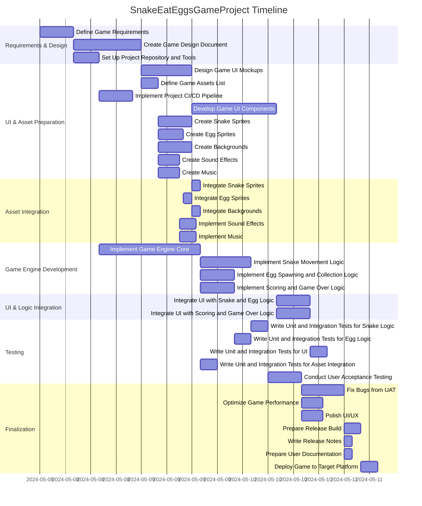

# Project Description

**Project Name:** SnakeEatEggsGameProject  
**Description:**  
This project is about creating a "Snake Eat Eggs" game, where players control a snake to collect eggs, grow longer, and avoid obstacles. The gameplay, assets, UI, sound, and deployment will all be handled through a defined software development lifecycle, culminating in a release for the target platforms.

---

# Task List Table

| id   | name                                      | description                                                                                                                | outline_level | dependent_tasks                  | parent_task | child_tasks                          | estimated_effort_in_hours | status       | required_skills                                   |
|------|-------------------------------------------|----------------------------------------------------------------------------------------------------------------------------|---------------|-----------------------------------|-------------|---------------------------------------|--------------------------|--------------|---------------------------------------------------|
| 1    | Define Game Requirements                  | Gather and document detailed requirements for the Snake Eat Eggs game, including gameplay mechanics, UI, platforms, etc.   | 1             |                                   |             | 2,3                                   | 8.0                      | Not Started  | Requirements Gathering, Game Design               |
| 2    | Create Game Design Document               | Develop a comprehensive game design document covering game rules, levels, scoring, controls, and visual style.             | 2             | 1                                 | 1           | 4,5                                   | 16.0                     | Not Started  | Game Design, Documentation                        |
| 3    | Set Up Project Repository and Tools       | Initialize version control repository, set up project management tools, and configure development environment.              | 2             | 1                                 | 1           | 6                                     | 6.0                      | Not Started  | Git, DevOps                                       |
| 4    | Design Game UI Mockups                    | Create visual mockups for the game's user interface, including menus, game screen, and score display.                      | 3             | 2                                 | 2           | 7                                     | 12.0                     | Not Started  | UI Design, UX Design                              |
| 5    | Define Game Assets List                   | List all required game assets such as sprites, backgrounds, and sound effects.                                             | 3             | 2                                 | 2           | 8a,8b,8c,8d,8e                        | 4.0                      | Not Started  | Game Design                                       |
| 6    | Implement Project CI/CD Pipeline          | Set up continuous integration and deployment pipeline for automated builds and tests.                                       | 3             | 3                                 | 3           |                                         | 8.0                      | Not Started  | CI/CD, DevOps                                      |
| 7    | Develop Game UI Components                | Implement the user interface components based on the approved mockups.                                                     | 4             | 4                                 | 4           |                                         | 20.0                     | Not Started  | Frontend Development, UI Implementation            |
| 8a   | Create Snake Sprites                      | Design and produce the snake sprites for the game.                                                                         | 4             | 5                                 | 5           | 9a                                    | 8.0                      | Not Started  | 2D Art                                            |
| 8b   | Create Egg Sprites                        | Design and produce the egg sprites for the game.                                                                           | 4             | 5                                 | 5           | 9b                                    | 6.0                      | Not Started  | 2D Art                                            |
| 8c   | Create Backgrounds                        | Design and produce background images for the game.                                                                         | 4             | 5                                 | 5           | 9c                                    | 8.0                      | Not Started  | 2D Art                                            |
| 8d   | Create Sound Effects                      | Produce sound effects for game actions such as eating eggs, collisions, and game over.                                     | 4             | 5                                 | 5           | 15a                                   | 5.0                      | Not Started  | Sound Design                                      |
| 8e   | Create Music                              | Compose and produce background music for the game.                                                                         | 4             | 5                                 | 5           | 15b                                   | 5.0                      | Not Started  | Music Composition                                 |
| 9a   | Integrate Snake Sprites                   | Integrate the snake sprites into the game engine and ensure they display and animate correctly.                            | 5             | 8a                                | 8a          |                                         | 2.0                      | Not Started  | Game Development, Asset Integration                |
| 9b   | Integrate Egg Sprites                     | Integrate the egg sprites into the game engine and ensure they display and animate correctly.                              | 5             | 8b                                | 8b          |                                         | 2.0                      | Not Started  | Game Development, Asset Integration                |
| 9c   | Integrate Backgrounds                     | Integrate the background images into the game engine and ensure they display correctly.                                    | 5             | 8c                                | 8c          |                                         | 2.0                      | Not Started  | Game Development, Asset Integration                |
| 10   | Implement Game Engine Core                | Develop core game engine logic, including game loop, input handling, and rendering.                                       | 2             | 3                                 |             | 11,12,13                              | 24.0                     | Not Started  | Game Development, Programming                      |
| 11   | Implement Snake Movement Logic            | Develop logic for snake movement, including direction changes and collision detection.                                     | 3             | 10                                | 10          |                                         | 12.0                     | Not Started  | Game Development, Programming                      |
| 12   | Implement Egg Spawning and Collection Logic| Develop logic for spawning eggs and handling their collection by the snake.                                                | 3             | 10                                | 10          |                                         | 8.0                      | Not Started  | Game Development, Programming                      |
| 13   | Implement Scoring and Game Over Logic     | Develop logic for scoring, tracking high scores, and handling game over conditions.                                       | 3             | 10                                | 10          |                                         | 8.0                      | Not Started  | Game Development, Programming                      |
| 14a  | Integrate UI with Snake and Egg Logic     | Connect UI components with the snake and egg logic to enable user interaction and display game state.                      | 2             | 7,9a,9b,11,12                     |             |                                         | 8.0                      | Not Started  | Frontend Development, Game Development             |
| 14b  | Integrate UI with Scoring and Game Over Logic| Connect UI components with scoring and game over logic to display scores and game over screens.                            | 2             | 7,13                              |             |                                         | 8.0                      | Not Started  | Frontend Development, Game Development             |
| 15a  | Implement Sound Effects                   | Integrate sound effects into the game, triggered by game events.                                                           | 5             | 8d,9a,9b,9c                       | 8d          |                                         | 4.0                      | Not Started  | Game Development, Audio Integration                |
| 15b  | Implement Music                           | Integrate background music into the game.                                                                                  | 5             | 8e,9c                             | 8e          |                                         | 4.0                      | Not Started  | Game Development, Audio Integration                |
| 16a  | Write Unit and Integration Tests for Snake Logic| Develop and execute unit and integration tests for the snake movement and related logic.                                | 2             | 11                                |             |                                         | 4.0                      | Not Started  | Testing, Game Development                          |
| 16b  | Write Unit and Integration Tests for Egg Logic | Develop and execute unit and integration tests for egg spawning and collection logic.                                  | 2             | 12                                |             |                                         | 4.0                      | Not Started  | Testing, Game Development                          |
| 16c  | Write Unit and Integration Tests for UI   | Develop and execute unit and integration tests for UI components and integration with game logic.                          | 2             | 14a,14b                           |             |                                         | 4.0                      | Not Started  | Testing, Frontend Development                      |
| 16d  | Write Unit and Integration Tests for Asset Integration | Develop and execute unit/integration tests for asset integration (sprites, backgrounds, sound, music).            | 2             | 9a,9b,9c,15a,15b                  |             |                                         | 4.0                      | Not Started  | Testing, Game Development                          |
| 17   | Conduct User Acceptance Testing           | Organize and execute UAT with target users to gather feedback and identify issues.                                        | 2             | 16a,16b,16c,16d                   |             |                                         | 8.0                      | Not Started  | Testing, User Research                             |
| 18a  | Fix Bugs from UAT                         | Address bugs and feedback identified during user acceptance testing.                                                       | 2             | 17                                |             |                                         | 10.0                     | Not Started  | Game Development, Debugging                        |
| 18b  | Optimize Game Performance                 | Optimize the game's performance for smooth gameplay and responsiveness.                                                    | 2             | 17                                |             |                                         | 5.0                      | Not Started  | Game Development, Performance Optimization         |
| 18c  | Polish UI/UX                              | Refine and polish the UI and UX based on feedback and best practices.                                                      | 2             | 17                                |             |                                         | 5.0                      | Not Started  | UI Design, UX Design                               |
| 19a  | Prepare Release Build                     | Create the final release build of the game for deployment.                                                                 | 2             | 18a,18b,18c                       |             |                                         | 4.0                      | Not Started  | Release Management                                 |
| 19b  | Write Release Notes                       | Write release notes describing the features, improvements, and known issues in the release.                                | 2             | 18a,18b,18c                       |             |                                         | 2.0                      | Not Started  | Documentation                                      |
| 19c  | Prepare User Documentation                | Prepare documentation to help players understand how to play the game.                                                     | 2             | 18a,18b,18c                       |             |                                         | 2.0                      | Not Started  | Documentation                                      |
| 20   | Deploy Game to Target Platform            | Deploy the game to the selected platform(s) and verify successful deployment.                                              | 2             | 19a,19b,19c                       |             |                                         | 4.0                      | Not Started  | Deployment, DevOps                                 |

---

# Task Gantt Diagram

