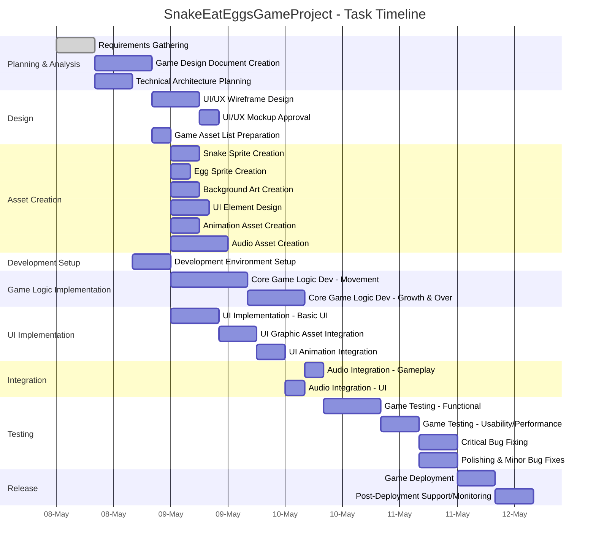

# Project Description

**Project Name:** SnakeEatEggsGameProject  
**Description:**  
This project centers on the development of the “Snake Eat Eggs” game. The goal is to create a fun, engaging, and well-designed game where players control a snake navigating through a play area, eating eggs to grow and score points, with visual, audio, and interactive elements tuned for an excellent user experience.

---

# Task List Table

| id   | name                                | description                                                                                                                                 | outline_level | dependent_tasks           | parent_task | child_tasks                  | estimated_effort_in_hours | status       | required_skills                                    |
|------|-------------------------------------|---------------------------------------------------------------------------------------------------------------------------------------------|---------------|--------------------------|-------------|------------------------------|--------------------------|--------------|----------------------------------------------------|
| 1    | Requirements Gathering              | Collect and document all requirements for the Snake Eat Eggs game, including gameplay mechanics, platform, graphics, audio, and user experience.| 1             |                          |             | 2, 3                        | 8                        | Not Started  | requirements analysis                             |
| 2    | Game Design Document Creation       | Create a detailed game design document (GDD) outlining game rules, controls, levels, scoring, visual style, and asset requirements.          | 2             | 1                        | 1           | 4, 5                        | 12                       | Not Started  | game design, documentation                        |
| 3    | Technical Architecture Planning     | Define the technical architecture, including technology stack, frameworks, and development tools for the game.                               | 2             | 1                        | 1           | 6                           | 8                        | Not Started  | software architecture, game development           |
| 4    | UI/UX Wireframe Design              | Design wireframes for the game's user interface and user experience, including menus, game screen, and score display.                        | 3             | 2                        | 2           | 7                           | 10                       | Not Started  | UI design, UX design                              |
| 5    | Game Asset List Preparation         | Prepare a comprehensive list of all game assets required, including sprites, backgrounds, sound effects, music, and animation assets.        | 3             | 2, 7                     | 2           | 8, 9, 20, 21, 22, 23         | 4                        | Not Started  | game design, asset management                     |
| 6    | Development Environment Setup       | Set up the development environment, including version control, build tools, and initial project structure.                                   | 3             | 3                        | 3           | 10, 11                      | 8                        | Not Started  | devops, software setup                            |
| 7    | UI/UX Mockup Approval               | Review and approve UI/UX mockups with stakeholders before proceeding to asset creation.                                                      | 4             | 4                        | 4           |                              | 4                        | Not Started  | UI review, stakeholder management                 |
| 8    | Snake Sprite Creation               | Design and create the sprite assets for the snake, including all movement frames.                                                            | 4             | 5                        | 5           |                              | 6                        | Not Started  | graphic design, game art                          |
| 9    | Egg Sprite Creation                 | Design and create the sprite assets for the eggs, including any variations.                                                                  | 4             | 5                        | 5           |                              | 4                        | Not Started  | graphic design, game art                          |
| 20   | Background Art Creation             | Design and create the background art for the game play area and menus.                                                                      | 4             | 5                        | 5           |                              | 6                        | Not Started  | graphic design, game art                          |
| 21   | UI Element Design                   | Design and create UI elements such as buttons, score displays, and menus.                                                                   | 4             | 5                        | 5           |                              | 8                        | Not Started  | UI design, graphic design                         |
| 22   | Animation Asset Creation            | Create animation assets for snake movement, egg collection, and UI transitions.                                                             | 4             | 5                        | 5           |                              | 6                        | Not Started  | animation, game art                               |
| 23   | Audio Asset Creation                | Create or source sound effects and background music for the game.                                                                           | 4             | 5                        | 5           |                              | 12                       | Not Started  | audio design, music production                    |
| 10   | Core Game Logic Dev - Movement      | Develop snake movement, boundary collision, and basic egg spawning.                                                                         | 4             | 6                        | 6           | 12                          | 16                       | Not Started  | game programming                                  |
| 12   | Core Game Logic Dev - Growth & Over | Implement snake growth on egg collection, game over conditions, and scoring logic.                                                          | 5             | 10                       | 10          | 14a, 14b                    | 12                       | Not Started  | game programming                                  |
| 11   | UI Implementation - Basic UI        | Implement the main menu, score display, and basic UI elements.                                                                              | 4             | 6, 7                     | 6           | 13a                         | 10                       | Not Started  | UI development                                    |
| 13a  | UI Graphic Asset Integration        | Integrate graphic assets (snake, eggs, background, UI elements) into the UI, polish interactions.                                           | 5             | 11, 8, 9, 20, 21         | 11          | 13b                         | 8                        | Not Started  | UI development, graphic integration               |
| 13b  | UI Animation Integration            | Integrate animation assets into the UI and ensure smooth transitions and effects.                                                           | 5             | 13a, 22                  | 13a         | 14b                         | 6                        | Not Started  | UI development, animation integration             |
| 14a  | Audio Integration - Gameplay        | Integrate audio assets (sound/music) into gameplay; triggers and balance.                                                                   | 6             | 12, 23                   | 12          |                              | 4                        | Not Started  | audio programming                                 |
| 14b  | Audio Integration - UI              | Integrate audio assets (sound/music) into UI; triggers and balance.                                                                         | 6             | 13b, 23                  | 13b         | 15                          | 4                        | Not Started  | audio programming                                 |
| 15   | Game Testing - Functional           | Test for functional correctness: gameplay, UI, audio.                                                                                       | 7             | 14a, 14b                 | 14b         | 16                          | 12                       | Not Started  | game testing                                      |
| 16   | Game Testing - Usability/Performance| Test for usability and performance, including UX, responsiveness, load times.                                                               | 8             | 15                       | 15          | 17, 18                      | 8                        | Not Started  | usability testing, performance testing            |
| 17   | Critical Bug Fixing                 | Fix critical bugs identified in testing.                                                                                                    | 9             | 16                       | 16          |                              | 8                        | Not Started  | debugging, game development                       |
| 18   | Polishing & Minor Bug Fixes         | Polish and fix minor bugs identified during usability and performance testing.                                                              | 9             | 16                       | 16          |                              | 8                        | Not Started  | debugging, game development                       |
| 19   | Game Deployment                     | Deploy the game to the target platform(s). Requires prior completion of bug fixing and polishing.                                           | 10            | 17, 18                   |             | 24                          | 8                        | Not Started  | deployment, platform integration                  |
| 24   | Post-Deployment Support/Monitoring  | Monitor logs, respond to user feedback, address critical post-launch issues.                                                                | 11            | 19                       | 19          |                              | 8                        | Not Started  | support, monitoring                               |

---

# Task Gantt Diagram

---

**Note:**  
- Task durations are in hours; for a real Gantt chart, these would be translated into calendar days considering working hours, parallelization, and team allocation.
- Dependencies reflect core workflow and prerequisite logic based on the provided data.