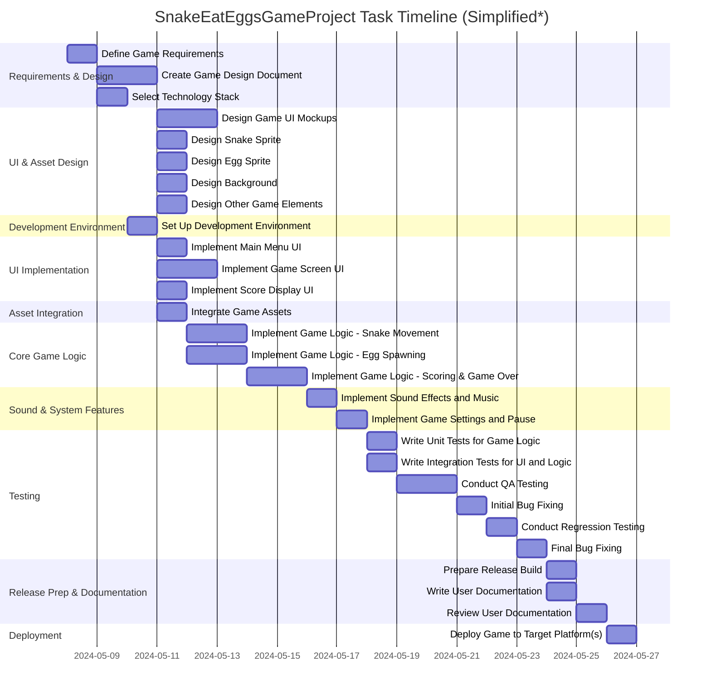

# SnakeEatEggsGameProject

## Project Description

This project is about creating a "Snake Eat Eggs" game. The goal is to develop a complete playable game from initial requirements gathering, design, asset creation, development, testing, and deployment to the selected platform(s). The workflow encompasses all key steps: requirements gathering, game design documentation, asset production, development (including UI, logic, and integration), testing (unit, integration, QA), bug fixing, release management, user documentation, and go-live deployment.

---

## Task List Table

| id    | name                                 | description                                                                                                                                | outline_level | dependent_tasks      | parent_task | child_tasks | estimated_effort_in_hours | status      | required_skills                              |
|-------|--------------------------------------|--------------------------------------------------------------------------------------------------------------------------------------------|---------------|----------------------|-------------|-------------|--------------------------|-------------|----------------------------------------------|
| 1     | Define Game Requirements             | Gather and document detailed requirements for the Snake Eat Eggs game, including gameplay mechanics, user interface, platforms, and constraints. | 1             | None                 | None        | None        | 8                        | Not Started | Requirements Gathering, Game Design           |
| 2     | Create Game Design Document          | Develop a comprehensive game design document covering rules, levels, scoring, controls, and visual style.                                  | 2             | 1                    | None        | None        | 16                       | Not Started | Game Design, Documentation                   |
| 3     | Select Technology Stack              | Evaluate and select the programming language, game engine, and libraries.                                                                  | 2             | 1                    | None        | None        | 8                        | Not Started | Technical Evaluation, Software Architecture   |
| 4     | Design Game UI Mockups               | Create visual mockups for the game's user interface.                                                                                      | 3             | 2                    | None        | None        | 16                       | Not Started | UI Design, Graphic Design                    |
| 5a    | Design Snake Sprite                  | Design and create the graphical asset for the snake character.                                                                            | 4             | 2                    | None        | None        | 6                        | Not Started | Graphic Design, Game Art                      |
| 5b    | Design Egg Sprite                    | Design and create the graphical asset for the egg object.                                                                                 | 4             | 2                    | None        | None        | 4                        | Not Started | Graphic Design, Game Art                      |
| 5c    | Design Background                    | Design and create background graphics.                                                                                                    | 4             | 2                    | None        | None        | 6                        | Not Started | Graphic Design, Game Art                      |
| 5d    | Design Other Game Elements           | Design and create other graphical assets (obstacles, UI icons, etc.).                                                                    | 4             | 2                    | None        | None        | 8                        | Not Started | Graphic Design, Game Art                      |
| 6     | Set Up Development Environment       | Install/configure development tools, libraries, and version control.                                                                      | 3             | 3                    | None        | None        | 8                        | Not Started | Software Setup, Version Control               |
| 7a    | Implement Main Menu UI               | Develop main menu UI based on mockups.                                                                                                    | 4             | 4, 6                 | None        | None        | 8                        | Not Started | UI Development, Frontend Programming          |
| 7b    | Implement Game Screen UI             | Develop in-game screen UI based on mockups.                                                                                              | 4             | 4, 6                 | None        | None        | 10                       | Not Started | UI Development, Frontend Programming          |
| 7c    | Implement Score Display UI           | Develop score display UI based on mockups.                                                                                               | 4             | 4, 6                 | None        | None        | 6                        | Not Started | UI Development, Frontend Programming          |
| 8     | Integrate Game Assets                | Integrate all game assets into the development environment.                                                                              | 4             | 5a,5b,5c,5d,6        | None        | None        | 8                        | Not Started | Game Asset Integration, Game Engine           |
| 9     | Implement Game Logic - Snake Movement| Develop logic for snake movement, direction changes, and collision detection.                                                            | 5             | 6,8                  | None        | None        | 10                       | Not Started | Game Programming, Algorithms                  |
| 10    | Implement Game Logic - Egg Spawning  | Develop logic for spawning eggs and handling snake eating eggs.                                                                           | 5             | 6,8                  | None        | None        | 10                       | Not Started | Game Programming, Algorithms                  |
| 11    | Implement Game Logic - Scoring and Game Over | Implement scoring and game over logic, integrate with UI.                                         | 6             | 9,10,7c              | None        | None        | 10                       | Not Started | Game Programming, UI Integration              |
| 12    | Implement Sound Effects and Music    | Add sound effects and background music.                                                                                                  | 7             | 11                   | None        | None        | 8                        | Not Started | Audio Engineering, Game Development           |
| 13    | Implement Game Settings and Pause    | Add game settings and pause/resume functionality.                                                                                        | 8             | 12                   | None        | None        | 8                        | Not Started | Game Programming, UI Development              |
| 14a   | Write Unit Tests for Game Logic      | Develop unit tests for major logic components.                                                                                           | 9             | 13                   | None        | None        | 8                        | Not Started | Testing, Game Development                     |
| 14b   | Write Integration Tests for UI/Logic | Develop integration tests for UI and logic.                                                                                              | 9             | 13                   | None        | None        | 8                        | Not Started | Testing, Game Development                     |
| 15a   | Conduct QA Testing                   | Perform QA testing and log bugs.                                                                                                         | 10            | 14a,14b              | None        | None        | 12                       | Not Started | QA Testing                                   |
| 15b   | Initial Bug Fixing                   | Fix critical and major bugs found during QA.                                                                                             | 10            | 15a                  | None        | None        | 8                        | Not Started | Bug Fixing, Game Development                  |
| 15c1  | Conduct Regression Testing           | Regression testing after initial bug fixes.                                                                                              | 10            | 15b                  | None        | None        | 2                        | Not Started | QA Testing                                   |
| 15c2  | Final Bug Fixing                     | Final bug fixes after regression testing.                                                                                                | 10            | 15c1                 | None        | None        | 2                        | Not Started | Bug Fixing, Game Development                  |
| 16a   | Prepare Release Build                | Prepare the final release build for distribution.                                                                                        | 11            | 15c2                 | None        | None        | 4                        | Not Started | Release Management                            |
| 16b   | Write User Documentation             | Write instructions and documentation for users.                                                                                          | 11            | 15c2                 | None        | None        | 4                        | Not Started | Documentation                                 |
| 16c   | Review User Documentation            | Review user documentation before release.                                                                                                | 11            | 16b                  | None        | None        | 2                        | Not Started | Documentation Review                          |
| 17    | Deploy Game to Platform(s)           | Deploy the game and verify successful deployment.                                                                                        | 12            | 16a,16c              | None        | None        | 8                        | Not Started | Deployment, DevOps                            |

---

## Task Gantt Diagram

---

*Note:*
- The Mermaid Gantt syntax only allows a single dependency per task. For tasks with **multiple dependencies (e.g., 7a, 8, 9, 10, 11, 17)**, the diagram places the task after the latest logically required predecessor. Actual project management and scheduling should coordinate all dependencies as listed in the table.
- Durations are in days for readability, with 1d representing 8 working hours. Adjust parallelization and scheduling as needed in actual planning.
- For comprehensive visualization of multiple dependencies and true parallelism, consider using a dedicated project management tool.

---
