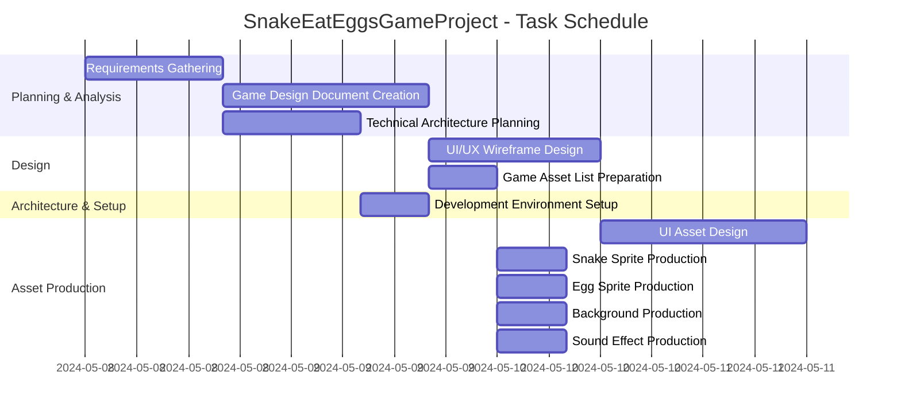

# Project Description

**Project Name:** SnakeEatEggsGameProject

**Description:**  
This project involves creating a classic "Snake Eat Eggs" game. The game will feature engaging gameplay mechanics, unique visuals, animation, and original sound effects, focusing on a compelling user experience. The project spans requirements gathering, design, technical planning, and the creation of graphical and audio assets.

---

# Task List Table

| id   | name                          | description                                                                                                                                                                       | outline_level | dependent_tasks | parent_task | child_tasks                 | estimated_effort_in_hours | status      | required_skills                | assigned_to           |
|------|-------------------------------|-----------------------------------------------------------------------------------------------------------------------------------------------------------------------------------|---------------|-----------------|-------------|-----------------------------|--------------------------|-------------|-------------------------------|-----------------------|
| 1    | Requirements Gathering        | Meet with stakeholders to gather and document detailed requirements for the Snake Eat Eggs game, including gameplay mechanics, platform, and user experience. Deliverable: Requirements specification document. | 1             | -               | null        | 2, 3                       | 16                       | Not Started | requirements analysis          | Business Analyst      |
| 2    | Game Design Document Creation | Create a comprehensive game design document (GDD) outlining game rules, mechanics, UI/UX, levels, and assets required. Deliverable: Approved GDD.                                 | 2             | 1               | 1           | 4, 5                       | 24                       | Not Started | game design, documentation     | Game Designer         |
| 3    | Technical Architecture Planning | Define the technical architecture, including technology stack, frameworks, and system components for the game. Deliverable: Technical architecture document.                       | 2             | 1               | 1           | 6                          | 16                       | Not Started | software architecture          | Solution Architect    |
| 4    | UI/UX Wireframe Design        | Design wireframes for the game's user interface and user experience, including menus, game screen, and controls. Deliverable: Wireframe mockups for all screens.                   | 3             | 2               | 2           | 7                          | 20                       | Not Started | UI/UX design                   | UI/UX Designer        |
| 5    | Game Asset List Preparation   | Prepare a detailed list of all game assets required, such as sprites, backgrounds, sounds, and animations. Deliverable: Asset list document.                                       | 3             | 2               | 2           | 8a, 8b, 8c, 8d             | 8                        | Not Started | game design                     | Game Designer         |
| 6    | Development Environment Setup | Set up the development environment, including version control, build tools, and initial project structure. Deliverable: Working dev environment and repository.                    | 3             | 3               | 3           | -                          | 8                        | Not Started | devops, software setup          | DevOps Engineer       |
| 7    | UI Asset Design               | Design and create UI assets such as buttons, menus, and icons based on wireframes. Deliverable: UI asset files (PNG/SVG/etc). Approval by design lead.                             | 4             | 4               | 4           | -                          | 24                       | Not Started | graphic design                  | Graphic Designer      |
| 8a   | Snake Sprite Production       | Design and produce all snake sprites and animations. Deliverable: Sprite files and animation sheets.                                         | 4             | 5               | 5           | -                          | 8                        | Not Started | graphic design                  | 2D Animator          |
| 8b   | Egg Sprite Production         | Design and produce all egg sprites and animations. Deliverable: Egg sprite files and animation sheets.                                       | 4             | 5               | 5           | -                          | 8                        | Not Started | graphic design                  | 2D Animator          |
| 8c   | Background Production         | Design and produce background images and tiles. Deliverable: Background image files.                                                        | 4             | 5               | 5           | -                          | 8                        | Not Started | graphic design                  | Background Artist     |
| 8d   | Sound Effect Production       | Produce all required sound effects for the game. Deliverable: Sound effect files (WAV/MP3/OGG).                                              | 4             | 5               | 5           | -                          | 8                        | Not Started | audio production                | Sound Designer        |

---

# Task Gantt Diagram

