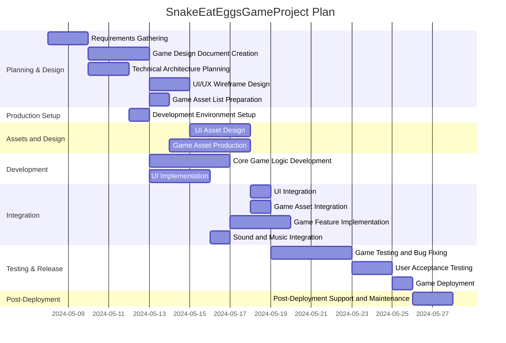

# Project Description

**Project Name:** SnakeEatEggsGameProject

**Description:**  
This project is about creating a "Snake Eat Eggs" game. The game will involve traditional snake gameplay mechanics, enhanced with modern UI/UX, levels, scoring, power-ups, and creative audio-visual assets. The deliverables include the full cycle from requirements and design, through technical implementation, to deployment and post-launch support.

---

# Task List Table

| id  | name                                 | description                                                                                             | outline_level | dependent_tasks       | parent_task | child_tasks     | estimated_effort_in_hours | status       | required_skills                  | assigned_to              |
|-----|--------------------------------------|---------------------------------------------------------------------------------------------------------|--------------|----------------------|-------------|-----------------|---------------------------|--------------|-----------------------------------|-------------------------|
| 1   | Requirements Gathering               | Collect and document all functional and non-functional requirements for the game.                       | 1            | -                    | -           | 2, 3           | 16                        | Not Started  | requirements analysis             | Business Analyst        |
| 2   | Game Design Document Creation        | Create a detailed game design document for the snake game.                                              | 2            | 1                    | 1           | 4, 5           | 20                        | Not Started  | game design, documentation        | Game Designer           |
| 3   | Technical Architecture Planning      | Define the technology stack and system components.                                                      | 2            | 1                    | 1           | 6              | 16                        | Not Started  | software architecture             | Solution Architect      |
| 4   | UI/UX Wireframe Design               | Design wireframes for the UI, including menus and score display.                                        | 3            | 2                    | 2           | 7              | 16                        | Not Started  | UI/UX design                      | UI/UX Designer          |
| 5   | Game Asset List Preparation          | Prepare a comprehensive list of all required game assets.                                               | 3            | 2                    | 2           | 8              | 8                         | Not Started  | game design                        | Game Designer           |
| 6   | Development Environment Setup        | Set up development environment with IDE, version control, and tools.                                    | 3            | 3                    | 3           | 9, 10          | 8                         | Not Started  | devops, software setup             | DevOps Engineer         |
| 7   | UI Asset Design                      | Create graphical assets for the UI based on wireframes.                                                 | 4            | 4                    | 4           | 11             | 24                        | Not Started  | graphic design                     | Graphic Designer        |
| 8   | Game Asset Production                | Produce all game assets: sprites, backgrounds, sounds, etc.                                             | 4            | 5                    | 5           | 12             | 32                        | Not Started  | graphic design, audio production   | Graphic Designer        |
| 9   | Core Game Logic Development          | Develop game logic (movement, collision, etc).                                                          | 4            | 6                    | 6           | 13             | 32                        | Not Started  | game development, programming      | Game Developer          |
| 10  | UI Implementation                    | Implement the user interface in the game.                                                               | 4            | 6                    | 6           | 14             | 24                        | Not Started  | UI development                     | UI Developer            |
| 11  | UI Integration                       | Integrate UI assets into the game engine.                                                               | 5            | 7, 10                | 7           | -               | 8                         | Not Started  | UI development                     | UI Developer            |
| 12  | Game Asset Integration               | Integrate produced assets into game engine.                                                             | 5            | 8, 9                 | 8           | -               | 8                         | Not Started  | game development                   | Game Developer          |
| 13  | Game Feature Implementation          | Implement additional features like levels and power-ups.                                                | 5            | 9                    | 9           | 15             | 24                        | Not Started  | game development                   | Game Developer          |
| 14  | Sound and Music Integration          | Integrate audio into the game.                                                                          | 5            | 8, 10                | 10          | -               | 8                         | Not Started  | audio integration                  | Audio Engineer          |
| 15  | Game Testing and Bug Fixing          | Test the game and fix issues.                                                                           | 6            | 11, 12, 13, 14       | 13          | 16             | 32                        | Not Started  | QA, game testing                   | QA Engineer             |
| 16  | User Acceptance Testing              | Conduct UAT with sample users; collect feedback.                                                        | 7            | 15                   | 15          | 17             | 16                        | Not Started  | QA, user testing                   | User Testing Specialist  |
| 17  | Game Deployment                      | Deploy game to target platforms (web, mobile, etc.).                                                    | 8            | 16                   | 16          | 18             | 8                         | Not Started  | deployment                         | Deployment Engineer     |
| 18  | Post-Deployment Support and Maintenance | Provide ongoing support post-launch.                                                                     | 9            | 17                   | 17          | -               | 16                        | Not Started  | support, maintenance               | Support Engineer        |

---

# Task Gantt Diagram

> **Note:** Gantt chart durations are aligned with estimated effort, assuming 8 hours = 1 workday.

