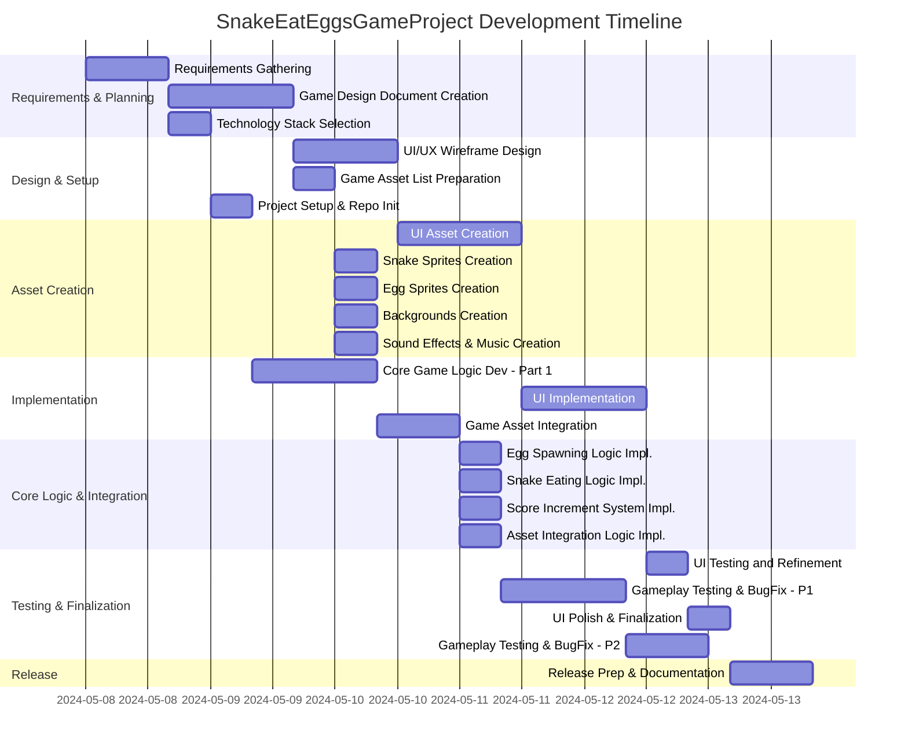

# SnakeEatEggsGameProject

## Project Description

The **SnakeEatEggsGameProject** aims to develop an engaging snake-themed game where the snake eats eggs to grow, earn points, and reach new levels. The project covers requirements gathering, technology selection, UI/UX and asset design, core logic programming, testing, and final release preparation. The game will focus on fun mechanics, a polished user interface, and smooth user experience.

---

## Task List Table

| id   | name                                | description                                                                                         | outline_level | dependent_tasks                | parent_task | child_tasks                  | estimated_effort_in_hours | status      | required_skills                | assigned_to                    |
|------|-------------------------------------|-----------------------------------------------------------------------------------------------------|---------------|-------------------------------|-------------|------------------------------|---------------------------|-------------|-------------------------------|-------------------------------|
| 1    | Requirements Gathering              | Collect and document all requirements for the Snake Eat Eggs game, including gameplay mechanics, platform, and user experience. | 1             | -                             | -           | 2, 3                        | 16                        | Not Started | requirements analysis           | Requirements Analyst (R1)     |
| 2    | Game Design Document Creation       | Create a detailed game design document covering rules, levels, scoring, UI/UX, and technical architecture. | 2             | 1                             | 1           | 4, 5                        | 24                        | Not Started | game design, documentation      | Game Designer (R2)            |
| 3    | Technology Stack Selection          | Select programming language, game engine, and tools for development.                                 | 2             | 1                             | 1           | 6                           | 8                         | Not Started | software architecture           | Software Architect (R3)       |
| 4    | UI/UX Wireframe Design              | Design wireframes for UI/UX including menus, game screen, and controls.                              | 3             | 2                             | 2           | 7                           | 20                        | Not Started | UI/UX design                    | UI/UX Designer (R4)           |
| 5    | Game Asset List Preparation         | List all required game assets (sprites, backgrounds, sound effects, music).                          | 3             | 2                             | 2           | 8a, 8b, 8c, 8d               | 8                         | Not Started | game design                     | Game Designer (R2)            |
| 6    | Project Setup and Repository Init.  | Set up project structure, initialize version control, and configure dev environment.                 | 3             | 3                             | 3           | 9                           | 8                         | Not Started | devops, software setup           | DevOps Engineer (R5)          |
| 7    | UI Asset Creation                   | Create graphical assets for UI (buttons, menus, icons) based on wireframes.                         | 4             | 4                             | 4           | 10                          | 24                        | Not Started | graphic design                   | Graphic Designer (R6)         |
| 8a   | Snake Sprites Creation              | Design and create all snake sprites (head, body, tail, movement frames).                            | 4             | 5                             | 5           | 11                          | 8                         | Not Started | graphic design                   | Graphic Designer (R6)         |
| 8b   | Egg Sprites Creation                | Design and create all egg sprites (various types/colors if needed).                                 | 4             | 5                             | 5           | 11                          | 8                         | Not Started | graphic design                   | Graphic Designer (R6)         |
| 8c   | Backgrounds Creation                | Design and create backgrounds for the game.                                                         | 4             | 5                             | 5           | 11                          | 8                         | Not Started | graphic design                   | Graphic Designer (R6)         |
| 8d   | Sound Effects & Music Creation      | Create/source sound effects (e.g. eating egg, game over) and background music.                       | 4             | 5                             | 5           | 11                          | 8                         | Not Started | audio production                  | Audio Producer (R7)           |
| 9    | Core Game Logic Dev - Part 1        | Implement basic snake movement and collision detection.                                              | 4             | 6                             | 6           | 12a                         | 24                        | Not Started | game programming                  | Game Programmer (R8)          |
| 10   | UI Implementation                   | Integrate UI assets into the game, implement menu navigation, score display, game over screens.      | 5             | 7                             | 7           | 13                          | 24                        | Not Started | UI programming                    | UI Programmer (R9)            |
| 11   | Game Asset Integration              | Integrate all created or sourced assets into the game engine.                                       | 5             | 8a, 8b, 8c, 8d                | -           | 12a,12b,12c,12d              | 16                        | Not Started | game development                  | Game Developer (R10)          |
| 12a  | Egg Spawning Logic Implementation   | Implement logic for spawning eggs at random intervals and positions.                                 | 5             | 9, 11                         | -           | 14                          | 8                         | Not Started | game programming                  | Game Programmer (R8)          |
| 12b  | Snake Eating Logic Implementation   | Implement logic for detecting when the snake eats an egg and handling the event.                     | 5             | 9, 11                         | -           | 14                          | 8                         | Not Started | game programming                  | Game Programmer (R8)          |
| 12c  | Score Increment System Impl.        | Implement the scoring system for when the snake eats an egg.                                         | 5             | 9, 11                         | -           | 14                          | 8                         | Not Started | game programming                  | Game Programmer (R8)          |
| 12d  | Asset Integration Logic Impl.       | Ensure all assets are referenced and triggered in the game logic.                                   | 5             | 9, 11                         | -           | 14                          | 8                         | Not Started | game programming                  | Game Programmer (R8)          |
| 13   | UI Testing and Refinement           | Test UI for usability and fix issues/inconsistencies.                                               | 6             | 10                            | 10          | 15                          | 8                         | Not Started | UI testing                         | UI Tester (R11)               |
| 14   | Gameplay Testing & Bug Fixing - P1  | Test core gameplay mechanics (egg spawning, eating, scoring), fix bugs.                             | 6             | 12a,12b,12c,12d               | -           | 16                          | 24                        | Not Started | game testing                        | Game Tester (R12)             |
| 15   | UI Polish and Finalization          | Polish UI based on feedback and finalize UI elements.                                               | 7             | 13                            | 13          | -                           | 8                         | Not Started | UI design                            | UI/UX Designer (R4)           |
| 16   | Gameplay Testing & Bug Fixing - P2  | Additional gameplay testing, fix remaining bugs, optimize performance.                              | 7             | 14                            | 14          | 17                          | 16                        | Not Started | game testing                        | Game Tester (R12)             |
| 17   | Release Prep and Documentation      | Prepare for release, create documentation, and package game.                                        | 8             | 15, 16                        | -           | -                           | 16                        | Not Started | documentation, release management   | Release Manager (R13)         |

---

## Task Gantt Diagram

> **Note:** For clarity, the Gantt diagram below uses `after task1, after task2` syntax to represent multiple dependencies where supported by Mermaid. Tasks that can run in parallel are shown as such. Task IDs in the diagram correspond to the IDs in the table above.

