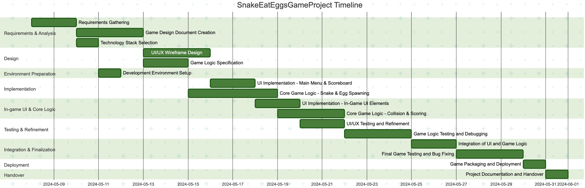

# Project Description

**Project Name:** SnakeEatEggsGameProject  
**Description:** This project is about creating a Snake Eat Eggs game. The game emphasizes classical snake gameplay where the player navigates the snake to eat eggs, resulting in score increments and increased snake length. The project covers requirements analysis, design, development, testing, integration, and deployment for a successful game release.

---

# Task List Table

| id  | name                                            | description                                                                                  | outline_level | dependent_tasks          | parent_task | child_tasks         | estimated_effort_in_hours | status       | required_skills                  | assigned_to      |
|-----|-------------------------------------------------|----------------------------------------------------------------------------------------------|---------------|-------------------------|-------------|--------------------|--------------------------|--------------|-----------------------------------|------------------|
| 1   | Requirements Gathering                          | Collect and document all requirements for the Snake Eat Eggs game, including gameplay mechanics, platform, and user experience. | 1             | -                       | -           | 2, 3               | 16.0                     | Not Started  | requirements analysis             | Resource1        |
| 2   | Game Design Document Creation                   | Create a detailed game design document with rules, levels, scoring, UI/UX, and architecture. | 2             | 1                       | 1           | 4, 5               | 24.0                     | Not Started  | game design, documentation        | -                |
| 3   | Technology Stack Selection                      | Evaluate and select the technology stack (engine, language, libraries) for the project.      | 2             | 1                       | 1           | 6                  | 8.0                      | Not Started  | software architecture             | -                |
| 4   | UI/UX Wireframe Design                          | Design wireframes for game UI/UX, menus, screens, and scoreboard.                            | 3             | 2                       | 2           | 7                  | 20.0                     | Not Started  | UI/UX design                      | -                |
| 5   | Game Logic Specification                        | Detail logic for snake movement, egg spawning, collision, and scoring.                       | 3             | 2                       | 2           | 8                  | 16.0                     | Not Started  | game design                       | Resource1        |
| 6   | Development Environment Setup                   | Set up environment: tools, libraries, version control.                                       | 3             | 3                       | 3           | 7, 8               | 8.0                      | Not Started  | devops                             | -                |
| 7   | UI Implementation - Main Menu and Scoreboard    | Develop main menu and scoreboard UI from wireframes.                                         | 4             | 4, 6                    | 4           | 9                  | 20.0                     | Not Started  | frontend development               | -                |
| 8   | Core Game Logic Implementation - Snake Movement and Egg Spawning | Implement snake movement and egg spawning core logic.                                        | 4             | 5, 6                    | 5           | 10                 | 32.0                     | Not Started  | game development                   | -                |
| 9   | UI Implementation - In-Game UI Elements         | Develop in-game UI (pause, restart, game over screens).                                      | 5             | 7                       | 7           | 11                 | 16.0                     | Not Started  | frontend development               | -                |
| 10  | Core Game Logic Implementation - Collision Detection and Scoring | Implement collision detection and scoring logic.                                             | 5             | 8                       | 8           | 12                 | 24.0                     | Not Started  | game development                   | -                |
| 11  | UI/UX Testing and Refinement                    | Test UI/UX for usability and make improvements.                                              | 6             | 9                       | 9           | -                  | 12.0                     | Not Started  | UI/UX testing                      | -                |
| 12  | Game Logic Testing and Debugging                | Test and debug snake movement, collision, and scoring.                                       | 6             | 10                      | 10          | 13                 | 20.0                     | Not Started  | QA, game testing                   | -                |
| 13  | Integration of UI and Game Logic                | Integrate UI with core game logic for seamless gameplay.                                     | 7             | 11, 12                  | 12          | 14                 | 16.0                     | Not Started  | integration, game development      | -                |
| 14  | Final Game Testing and Bug Fixing               | Final testing and bugfixing for integrated game.                                             | 8             | 13                      | 13          | 15                 | 20.0                     | Not Started  | QA, game testing                   | -                |
| 15  | Game Packaging and Deployment                   | Package and deploy the game to target platforms.                                             | 9             | 14                      | 14          | 16                 | 8.0                      | Not Started  | deployment                         | -                |
| 16  | Project Documentation and Handover              | Prepare documentation and handover package.                                                  | 10            | 15                      | 15          | -                  | 8.0                      | Not Started  | documentation                      | -                |

---

# Task Gantt Diagram

> **Note:** 1 day = 8 hours of work. Task durations are rounded up to the nearest whole day.  
> **Important:** Some tasks (such as Task 7 and Task 8) have multiple dependencies in the original plan. Since Mermaid Gantt charts only support a single dependency per task, the chart below represents the primary dependency for each such task. For full accuracy, please refer to the Task List Table above.

---