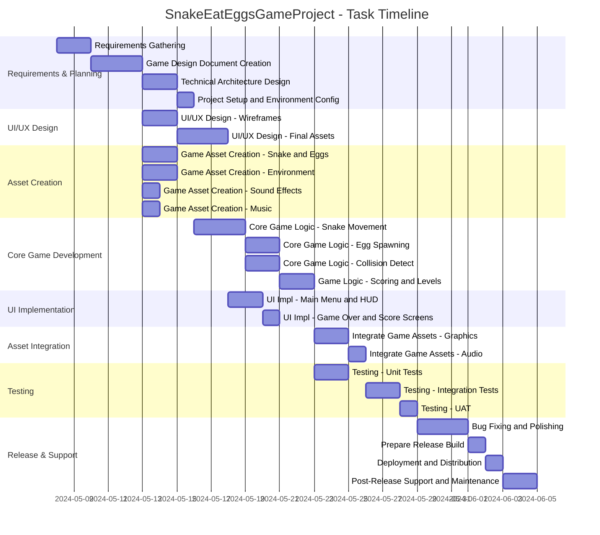

# Project Description

**Project Name:** SnakeEatEggsGameProject

**Description:**  
This project focuses on creating the "Snake Eat Eggs" game, a digital game where users control a snake to eat eggs, featuring core gameplay development, asset creation, UI/UX, testing, deployment, and post-release support.

---

# Task List Table

| id  | name                                      | description                                                                                     | outline_level | dependent_tasks        | parent_task | child_tasks | estimated_effort_in_hours | status       | required_skills                | assigned_to                        |
|-----|-------------------------------------------|-------------------------------------------------------------------------------------------------|---------------|-----------------------|-------------|-------------|--------------------------|--------------|-------------------------------|-------------------------------------|
| 1   | Requirements Gathering                    | Collect and document all requirements for the Snake Eat Eggs game, including gameplay mechanics, platform, and user experience. | 1             |                       |             |             | 16                       | Not Started | requirements analysis           | MockResource-requirements analysis  |
| 2   | Game Design Document Creation             | Create a detailed game design document covering game rules, UI/UX, levels, scoring, and assets needed. | 1             | 1                     |             |             | 24                       | Not Started | game design, documentation      | MockResource-game design            |
| 3   | Technical Architecture Design             | Design the technical architecture, including technology stack, game engine selection, and system components. | 1             | 2                     |             |             | 16                       | Not Started | software architecture           | MockResource-software architecture  |
| 4   | Project Setup and Environment Configuration | Set up version control, project repository, and development environment for the team.            | 1             | 3                     |             |             | 8                        | Not Started | devops, configuration           | MockResource-devops                 |
| 5   | UI/UX Design - Wireframes                 | Create wireframes for all game screens, including main menu, gameplay, and score screens.        | 1             | 2                     |             |             | 16                       | Not Started | ui design                       | MockResource-ui design              |
| 6   | UI/UX Design - Final Assets               | Design and deliver final UI assets based on approved wireframes.                                 | 1             | 5                     |             |             | 24                       | Not Started | ui design, graphic design        | MockResource-ui design              |
| 7   | Game Asset Creation - Snake and Eggs      | Design and create graphical assets for the snake and eggs.                                       | 1             | 2                     |             |             | 16                       | Not Started | graphic design                   | MockResource-graphic design         |
| 8   | Game Asset Creation - Environment         | Design and create background and environment assets for the game.                                | 1             | 2                     |             |             | 16                       | Not Started | graphic design                   | MockResource-graphic design         |
| 9   | Game Asset Creation - Sound Effects       | Create or source sound effects for game actions (e.g., eating eggs, game over).                  | 1             | 2                     |             |             | 8                        | Not Started | audio design                     | MockResource-audio design           |
| 10  | Game Asset Creation - Music               | Create or source background music for the game.                                                 | 1             | 2                     |             |             | 8                        | Not Started | music composition                | MockResource-music composition      |
| 11  | Core Game Logic Development - Snake Movement | Implement the core logic for snake movement and controls.                                        | 1             | 4, 7                  |             |             | 24                       | Not Started | game development                 | MockResource-game development       |
| 12  | Core Game Logic Development - Egg Spawning and Eating | Implement logic for spawning eggs and handling snake eating eggs.                                  | 1             | 11                    |             |             | 16                       | Not Started | game development                 | MockResource-game development       |
| 13  | Core Game Logic Development - Collision Detection | Implement collision detection for snake with itself, walls, and eggs.                             | 1             | 11                    |             |             | 16                       | Not Started | game development                 | MockResource-game development       |
| 14  | Game Logic - Scoring and Levels           | Implement scoring system and level progression logic.                                            | 1             | 12, 13                |             |             | 16                       | Not Started | game development                 | MockResource-game development       |
| 15  | UI Implementation - Main Menu and HUD     | Develop the main menu and in-game HUD using final UI assets.                                     | 1             | 4, 6                  |             |             | 16                       | Not Started | ui development                   | MockResource-ui development         |
| 16  | UI Implementation - Game Over and Score Screens | Develop the game over and score screens using final UI assets.                                   | 1             | 15                    |             |             | 8                        | Not Started | ui development                   | MockResource-ui development         |
| 17  | Integrate Game Assets - Graphics          | Integrate all graphical assets (snake, eggs, environment) into the game engine.                  | 1             | 11,12,13,14,7,8        |             |             | 16                       | Not Started | game development                 | MockResource-game development       |
| 18  | Integrate Game Assets - Audio             | Integrate sound effects and music into the game engine.                                          | 1             | 17,9,10                |             |             | 8                        | Not Started | game development                 | MockResource-game development       |
| 19  | Testing - Unit Tests                      | Write and execute unit tests for core game logic components.                                     | 1             | 11,12,13,14            |             |             | 16                       | Not Started | testing                          | MockResource-testing                |
| 20  | Testing - Integration Tests               | Write and execute integration tests for game components and asset integration.                   | 1             | 17,18                  |             |             | 16                       | Not Started | testing                          | MockResource-testing                |
| 21  | Testing - User Acceptance Testing (UAT)   | Conduct user acceptance testing to validate the game meets requirements and is enjoyable.         | 1             | 20                    |             |             | 8                        | Not Started | testing, user experience         | MockResource-testing                |
| 22  | Bug Fixing and Polishing                  | Fix bugs identified during testing and polish gameplay, UI, and performance.                     | 1             | 19,20,21               |             |             | 24                       | Not Started | game development, ui development  | MockResource-game development       |
| 23  | Prepare Release Build                     | Prepare the final release build of the game for the target platform(s).                          | 1             | 22                    |             |             | 8                        | Not Started | devops, game development         | MockResource-devops                 |
| 24  | Deployment and Distribution               | Deploy and distribute the game to the chosen platform(s) or app stores.                          | 1             | 23                    |             |             | 8                        | Not Started | devops                           | MockResource-devops                 |
| 25  | Post-Release Support and Maintenance      | Monitor the game post-release, address critical bugs, and provide updates as needed.             | 1             | 24                    |             |             | 16                       | Not Started | game development, support         | MockResource-game development       |

---

# Task Gantt Diagram

> **Legend:**  
> 8 hours = 1 day, 16 hours = 2 days, 24 hours = 3 days.  
> Tasks with multiple dependencies will start after all dependencies are complete.  
> Tasks that can be done in parallel are shown as such.

