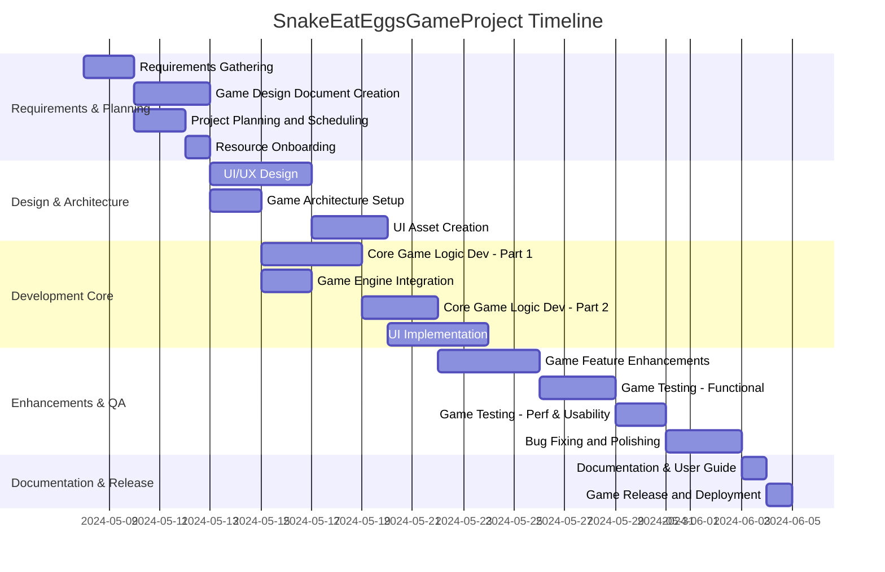

# Project Description

**Project Name:** SnakeEatEggsGameProject  
**Description:**  
This project is about creating a "Snake Eat Eggs" game, including design, development, testing, and release across all major steps of a typical software development lifecycle.

---

# Task List Table

| id  | name                                 | description                                                                                                 | outline_level | dependent_tasks | parent_task | child_tasks   | estimated_effort_in_hours | status      | required_skills                  | assigned_to                              |
|-----|--------------------------------------|-------------------------------------------------------------------------------------------------------------|---------------|-----------------|-------------|---------------|---------------------------|-------------|------------------------------------|------------------------------------------|
| 1   | Requirements Gathering               | Collect and document all game requirements, including gameplay, platform, user experience.                  | 1             |                 |             | 2, 3          | 16                        | Not Started | requirements analysis, communication | MockResource-requirements analysis       |
| 2   | Game Design Document Creation        | Create detailed design doc: rules, levels, scoring, UI/UX, technical architecture.                          | 2             | 1               | 1           | 4, 5          | 24                        | Not Started | game design, documentation          | MockResource-game design                 |
| 3   | Project Planning and Scheduling      | Develop project plan: timeline, milestones, resources, risks.                                               | 2             | 1               | 1           | 6             | 12                        | Not Started | project management                  | MockResource-project management          |
| 4   | UI/UX Design                        | UI and UX design for menus, game screens, controls.                                                         | 3             | 2               | 2           | 7             | 32                        | Not Started | UI design, UX design                | MockResource-UI design                   |
| 5   | Game Architecture Setup             | Set up project structure, select frameworks, configure version control.                                     | 3             | 2               | 2           | 8, 9          | 16                        | Not Started | software architecture, version control | MockResource-software architecture    |
| 6   | Resource Onboarding                 | Onboard developers, designers, testers; provide access and documentation.                                   | 3             | 3               | 3           |               |                           | Not Started | project coordination                | MockResource-project coordination        |
| 7   | UI Asset Creation                   | Create game UI graphics: buttons, backgrounds, icons.                                                       | 4             | 4               | 4           |               | 24                        | Not Started | graphic design                      | MockResource-graphic design              |
| 8   | Core Game Logic Development - Part 1 | Core logic: snake movement, collision detection, egg spawning (1st half).                                   | 4             | 5               | 5           | 10            | 32                        | Not Started | game development, programming        | MockResource-game development            |
| 9   | Game Engine Integration             | Integrate chosen game engine/framework with project.                                                        | 4             | 5               | 5           | 11            | 16                        | Not Started | game engine, integration             | MockResource-game engine                 |
| 10  | Core Game Logic Development - Part 2 | Complete core game logic: scoring, game over, snake growth.                                                 | 5             | 8               | 8           | 12            | 24                        | Not Started | game development, programming        | MockResource-game development            |
| 11  | UI Implementation                   | Implement UI/UX, integrate UI assets into the game.                                                         | 5             | 7,9             | 9           | 13            | 32                        | Not Started | UI development, game development     | MockResource-UI development              |
| 12  | Game Feature Enhancements           | Add features: power-ups, levels, sound effects.                                                             | 6             | 10              | 10          | 14            | 32                        | Not Started | game development, audio design       | MockResource-game development            |
| 13  | Game Testing - Functional           | Functional testing: gameplay, UI, scoring.                                                                  | 6             | 11,12           | 11          | 15            | 24                        | Not Started | QA, game testing                     | MockResource-QA                          |
| 14  | Game Testing - Performance & Usability | Test performance, responsiveness, user experience.                                                        | 7             | 13              | 12          | 16            | 16                        | Not Started | QA, usability testing                | MockResource-QA                          |
| 15  | Bug Fixing and Polishing            | Bug fixes from testing and final polish.                                                                    | 8             | 14              | 13          | 17            | 24                        | Not Started | game development, QA                 | MockResource-game development            |
| 16  | Documentation and User Guide        | Prepare documentation and user guide for the game.                                                          | 9             | 15              | 14          |               | 8                         | Not Started | documentation, writing               | MockResource-documentation               |
| 17  | Game Release and Deployment         | Deploy game to platforms, make available to users.                                                          | 10            | 16              | 15          |               | 8                         | Not Started | deployment, release management        | MockResource-deployment                  |

---

# Task Gantt Diagram

---

**Legend:**
- `after aX` means the task starts after completion of task with id "X".
- Durations are now consistent: 8 hours = 1 day, 16 hours = 2 days, 24 hours = 3 days, 32 hours = 4 days.

---

This structure provides a clear view of how the "Snake Eat Eggs" game project will progress, from inception to final deployment.