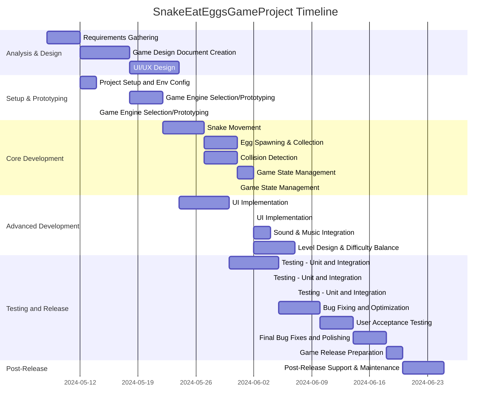

# Project Description

**Project Name:** SnakeEatEggsGameProject  
**Description:**  
This project is about creating a "Snake Eat Eggs" game. The scope includes requirements gathering, designing, development, testing, release preparation, and post-release support for a game where the player controls a snake that consumes eggs as its main gameplay mechanic. The project will be structured into several key phases, ensuring an organized and efficient approach from inception to post-release maintenance.

---

# Task List Table

| id  | name                                           | description                                                                                      | outline_level | dependent_tasks      | parent_task | child_tasks | estimated_effort_in_hours | status       | required_skills            | assigned_to                    |
|-----|------------------------------------------------|--------------------------------------------------------------------------------------------------|---------------|---------------------|-------------|-------------|--------------------------|--------------|----------------------------|-------------------------------|
| 1   | Requirements Gathering                         | Collect and document all requirements for the Snake Eat Eggs game, including gameplay mechanics, user interface, and platform support. | 1             | -                   | -           | -           | 16                       | Not Started  | requirements analysis      | MockResource-requirements analysis |
| 2   | Game Design Document Creation                  | Create a detailed game design document covering game rules, levels, scoring, UI/UX, and technical architecture. | 1             | 1                   | -           | -           | 24                       | Not Started  | game design, documentation | MockResource-game design           |
| 3   | Project Setup and Environment Configuration    | Set up version control, project repository, and development environment for the team.             | 1             | 1                   | -           | -           | 8                        | Not Started  | devops, configuration      | MockResource-devops                 |
| 4   | UI/UX Design                                  | Design the user interface and user experience for the game, including menus, game screen, and controls. | 1             | 2                   | -           | -           | 24                       | Not Started  | ui design, ux design       | MockResource-ui design              |
| 5   | Game Engine Selection and Prototyping         | Select a suitable game engine and create a basic prototype to validate core mechanics.            | 1             | 2, 3                | -           | -           | 16                       | Not Started  | game development, prototyping | MockResource-game development   |
| 6   | Core Game Logic Dev - Snake Movement          | Implement the core logic for snake movement and controls.                                        | 2             | 5                   | -           | -           | 20                       | Not Started  | programming                | MockResource-programming            |
| 7   | Core Game Logic Dev - Egg Spawning & Collection | Implement logic for spawning eggs and handling their collection by the snake.                  | 2             | 6                   | -           | -           | 16                       | Not Started  | programming                | MockResource-programming            |
| 8   | Core Game Logic Dev - Collision Detection     | Implement collision detection for snake with walls, itself, and eggs.                            | 2             | 6                   | -           | -           | 16                       | Not Started  | programming                | MockResource-programming            |
| 9   | Game State Management                         | Implement game state management (start, pause, resume, game over).                              | 2             | 7, 8                | -           | -           | 12                       | Not Started  | programming                | MockResource-programming            |
| 10  | UI Implementation                             | Develop the user interface based on the UI/UX designs, including menus, score display, and controls. | 2         | 4, 9                | -           | -           | 24                       | Not Started  | ui development             | MockResource-ui development         |
| 11  | Sound and Music Integration                   | Add sound effects and background music to the game.                                             | 2             | 9                   | -           | -           | 8                        | Not Started  | audio integration          | MockResource-audio integration      |
| 12  | Level Design and Difficulty Balancing         | Design different levels and balance the difficulty progression.                                 | 2             | 9                   | -           | -           | 20                       | Not Started  | game design                | MockResource-game design             |
| 13  | Testing - Unit and Integration                | Write and execute unit and integration tests for all modules.                                    | 3             | 10, 11, 12          | -           | -           | 24                       | Not Started  | testing                    | MockResource-testing                 |
| 14  | Bug Fixing and Optimization                   | Fix bugs identified during testing and optimize game performance.                                | 3             | 13                  | -           | -           | 20                       | Not Started  | debugging, optimization    | MockResource-debugging                |
| 15  | User Acceptance Testing (UAT)                 | Conduct user acceptance testing with a sample of target users and collect feedback.              | 3             | 14                  | -           | -           | 16                       | Not Started  | testing, user research     | MockResource-testing                |
| 16  | Final Bug Fixes and Polishing                 | Address feedback from UAT and perform final polishing of the game.                              | 3             | 15                  | -           | -           | 16                       | Not Started  | debugging, polishing       | MockResource-debugging                |
| 17  | Game Release Preparation                      | Prepare release notes, package the game, and set up distribution channels.                      | 3             | 16                  | -           | -           | 8                        | Not Started  | release management         | MockResource-release management      |
| 18  | Post-Release Support and Maintenance          | Monitor the game post-release, address any critical issues, and provide updates as needed.       | 3             | 17                  | -           | -           | 20                       | Not Started  | support, maintenance       | MockResource-support                  |

---

# Task Gantt Diagram

---

**Note:** All durations are estimated based on standard 8-hour workdays. Task dependencies reflect the order of task execution as described in your project plan.