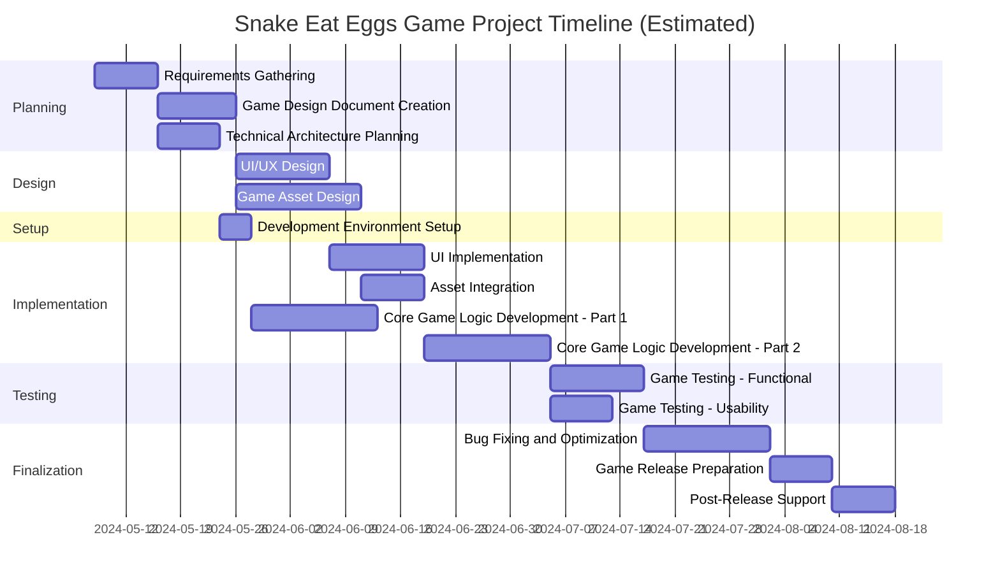

```markdown
# Project Description

**Project Name:** SnakeEatEggsGameProject

**Description:**  
This project focuses on the design, development, testing, and release of the "Snake Eat Eggs" game. The game will feature classic snake gameplay with egg collection mechanics, enhanced for a modern platform with engaging graphics, user-friendly UI/UX, and immersive sound. The project encompasses multiple phases: requirements gathering, game design, technical architecture, UI/UX design, asset creation, development, QA/testing, release preparation, and post-release support.

**Planned Timeline:**  
Start Date: 2024-05-08  
End Date: 2024-07-08  

---

# Task List Table

| id  | name                              | description                                                                                      | outline_level | dependent_tasks  | parent_task | child_tasks      | estimated_effort_in_hours | status      | required_skills                    | assigned_to                        |
|:----|:----------------------------------|:-------------------------------------------------------------------------------------------------|:-------------:|:-----------------|:-----------|:-----------------|:-------------------------:|:-----------|:-----------------------------------|:-----------------------------------|
| 1   | Requirements Gathering            | Collect and document all requirements for the Snake Eat Eggs game...                             | 1             | -                | -          | 2, 3             | 16.0                      | Not Started| requirements analysis              | MockResource-requirements analysis  |
| 2   | Game Design Document Creation     | Create a detailed game design document...                                                        | 2             | 1                | 1         | 4, 5             | 20.0                      | Not Started| game design, documentation         | MockResource-game design            |
| 3   | Technical Architecture Planning   | Define the technical architecture, including technology stack, frameworks...                     | 2             | 1                | 1         | 6                | 16.0                      | Not Started| software architecture              | MockResource-software architecture  |
| 4   | UI/UX Design                     | Design the user interface and user experience for the game...                                    | 3             | 2                | 2         | 7                | 24.0                      | Not Started| UI design, UX design               | MockResource-UI design              |
| 5   | Game Asset Design                 | Design and create all game assets such as sprites, backgrounds, and sound effects                | 3             | 2                | 2         | 8                | 32.0                      | Not Started| graphic design, audio design       | MockResource-graphic design         |
| 6   | Development Environment Setup     | Set up the development environment including version control...                                  | 3             | 3                | 3         | 9                | 8.0                       | Not Started| devops, software setup             | MockResource-devops                 |
| 7   | UI Implementation                 | Implement the user interface based on the UI/UX designs                                         | 4             | 4, 6             | 4         | 10               | 24.0                      | Not Started| frontend development               | MockResource-frontend development   |
| 8   | Asset Integration                 | Integrate designed assets into the game project                                                  | 4             | 5, 6             | 5         | 10               | 16.0                      | Not Started| game development                   | MockResource-game development       |
| 9   | Core Game Logic Development - P1  | Develop the core game logic (first half)                                                         | 4             | 6                | 6         | 10               | 32.0                      | Not Started| game programming                   | MockResource-game programming       |
| 10  | Core Game Logic Development - P2  | Complete the core game logic (second half)                                                       | 5             | 7, 8, 9          | -         | 11, 12           | 32.0                      | Not Started| game programming                   | MockResource-game programming       |
| 11  | Game Testing - Functional         | Test the game for functional correctness                                                         | 6             | 10               | 10        | 13               | 24.0                      | Not Started| QA testing                         | MockResource-QA testing             |
| 12  | Game Testing - Usability          | Test the game for usability and user experience, gather feedback                                 | 6             | 10               | 10        | 13               | 16.0                      | Not Started| usability testing                  | MockResource-usability testing      |
| 13  | Bug Fixing and Optimization       | Fix bugs identified during testing and optimize game performance                                 | 7             | 11, 12           | -         | 14               | 32.0                      | Not Started| game programming, QA               | MockResource-game programming       |
| 14  | Game Release Preparation          | Prepare the game for release, including packaging, documentation, deployment setup               | 8             | 13               | 13        | 15               | 16.0                      | Not Started| release management                 | MockResource-release management     |
| 15  | Post-Release Support              | Provide support for the game after release                                                       | 9             | 14               | 14        | -                | 16.0                      | Not Started| support, game programming          | MockResource-support                |

---

# Task Gantt Diagram



---

**Note:**  
- Task durations and dependencies are based on provided effort hours and logical phase transitions.
- Actual start and end dates may shift depending on resource allocation and project velocity.
```
