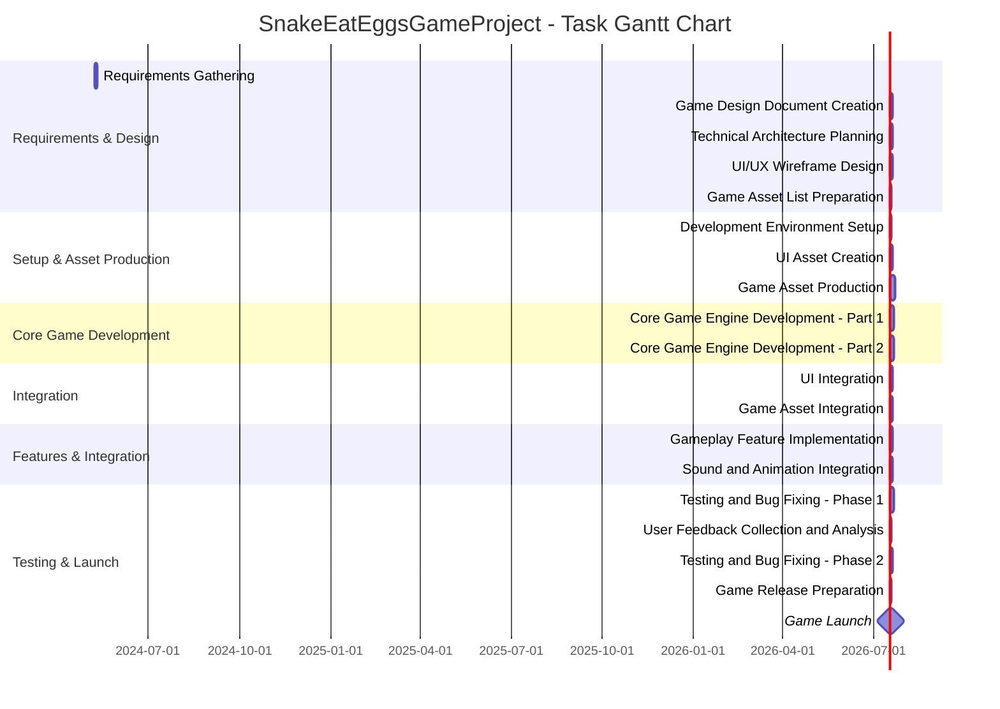

# Project Description

**Project Name:** SnakeEatEggsGameProject  
**Client:** John Doe (123-456-7890, john.doe@example.com), 123 Main St, Anytown, USA  
**Supplier:** Jane Smith (987-654-3210, jane.smith@example.com), 456 Elm St, Othertown, USA  
**Estimated Start Date:** 2024-05-08  
**Estimated Finish Date:** 2024-07-08  
**Project Type:** Software Development  
**Scope of Work:**  
Design, develop, test, and deploy a "Snake Eat Eggs" game. The project includes requirements gathering, UI/UX design, game logic implementation, testing, bug fixing, and launch support. The game will feature classic snake gameplay with egg collection mechanics, score tracking, and increasing difficulty.

---

# Task List Table

| id  | name                                              | description                                                                                                         | outline_level | dependent_tasks       | parent_task | child_tasks               | estimated_effort_in_hours | status       | required_skills                      | assigned_to                         |
|-----|---------------------------------------------------|---------------------------------------------------------------------------------------------------------------------|---------------|----------------------|-------------|---------------------------|--------------------------|--------------|--------------------------------------|--------------------------------------|
| 1   | Requirements Gathering                            | Meet with stakeholders to gather and document requirements for the Snake Eat Eggs game.                             | 1             |                      |             | 2, 3                      | 16                       | Not Started | requirements analysis, communication | MockResource-requirements analysis   |
| 2   | Game Design Document Creation                     | Create a comprehensive game design document (GDD) outlining game rules, mechanics, UI/UX, levels, and assets.       | 2             | 1                    | 1           | 4, 5                      | 24                       | Not Started | game design, documentation           | MockResource-game design             |
| 3   | Technical Architecture Planning                   | Define the technical architecture, including stack, frameworks, and components for the game.                        | 2             | 1                    | 1           | 6                         | 16                       | Not Started | software architecture, planning      | MockResource-software architecture   |
| 4   | UI/UX Wireframe Design                            | Design wireframes for the game's UI/UX based on the GDD.                                                            | 3             | 2                    | 2           | 7                         | 20                       | Not Started | UI/UX design                        | MockResource-UI/UX design            |
| 5   | Game Asset List Preparation                       | Prepare a detailed list of all game assets required.                                                                | 3             | 2                    | 2           | 8                         | 8                        | Not Started | game design                          | MockResource-game design             |
| 6   | Development Environment Setup                     | Set up version control, build tools, and initial project structure.                                                 | 3             | 3                    | 3           | 9                         | 8                        | Not Started | devops, software setup               | MockResource-devops                  |
| 7   | UI Asset Creation                                 | Create all UI assets (buttons, menus, icons) based on the wireframes.                                               | 4             | 4                    | 4           | 10                        | 24                       | Not Started | graphic design                        | MockResource-graphic design          |
| 8   | Game Asset Production                             | Produce all game assets as per asset list.                                                                          | 4             | 5                    | 5           | 11                        | 40                       | Not Started | graphic design, audio production      | MockResource-graphic design          |
| 9   | Core Game Engine Development - Part 1             | Develop core game engine logic (snake movement, collision, basic loop).                                             | 4             | 6                    | 6           | 12                        | 32                       | Not Started | game programming                      | MockResource-game programming        |
| 10  | UI Integration                                    | Integrate UI assets; ensure menus and controls function as designed.                                                | 5             | 7, 9                 | 7           | 13                        | 16                       | Not Started | game programming, UI integration      | MockResource-game programming        |
| 11  | Game Asset Integration                            | Integrate all produced game assets into the game engine.                                                            | 5             | 8, 9                 | 8           | 14                        | 16                       | Not Started | game programming, asset integration   | MockResource-game programming        |
| 12  | Core Game Engine Development - Part 2             | Complete game engine logic (scoring, egg spawning, game-over).                                                      | 5             | 9                    | 9           | 10, 11                    | 32                       | Not Started | game programming                      | MockResource-game programming        |
| 13  | Gameplay Feature Implementation                   | Implement gameplay features: power-ups, increasing difficulty, special eggs.                                        | 6             | 10                   | 10          | 15                        | 24                       | Not Started | game programming                      | MockResource-game programming        |
| 14  | Sound and Animation Integration                   | Integrate sound effects and animations.                                                                             | 6             | 11                   | 11          | 15                        | 16                       | Not Started | game programming, audio integration   | MockResource-game programming        |
| 15  | Testing and Bug Fixing - Phase 1                  | Conduct initial testing; identify and fix critical issues.                                                          | 7             | 13, 14               |             | 16                        | 32                       | Not Started | QA, game programming                  | MockResource-QA                     |
| 16  | User Feedback Collection and Analysis             | Collect test user feedback and analyze results.                                                                     | 8             | 15                   | 15          | 17                        | 8                        | Not Started | user research                         | MockResource-user research           |
| 17  | Testing and Bug Fixing - Phase 2                  | Address issues from feedback; conduct final testing.                                                                | 9             | 16                   | 16          | 18                        | 16                       | Not Started | QA, game programming                  | MockResource-QA                     |
| 18  | Game Release Preparation                          | Prepare game for release: packaging, documentation, marketing materials.                                            | 10            | 17                   | 17          | 19                        | 8                        | Not Started | release management                    | MockResource-release management      |
| 19  | Game Launch                                       | Launch to target platform(s) and monitor for issues.                                                                | 11            | 18                   | 18          |                           | 4                        | Not Started | release management                    | MockResource-release management      |

---

# Task Gantt Diagram

---

**Notes:**  
- Task durations are now aligned with estimated effort (8 hours = 1 day, rounded up).
- All tasks are marked as 'Not Started' in both the table and Gantt chart for consistency.
- Multiple dependencies in the Gantt chart use the correct Mermaid syntax (multiple 'after' statements).
- The Gantt chart starts from the actual project start date and calculates subsequent dates based on dependencies and durations.
- Parent/child relationships are reflected in the outline levels and task dependencies.
- Please adjust actual dates and durations as per real project scheduling and resource availability.
- "assigned_to" values are mock resource placeholders and should be updated with real team assignments.