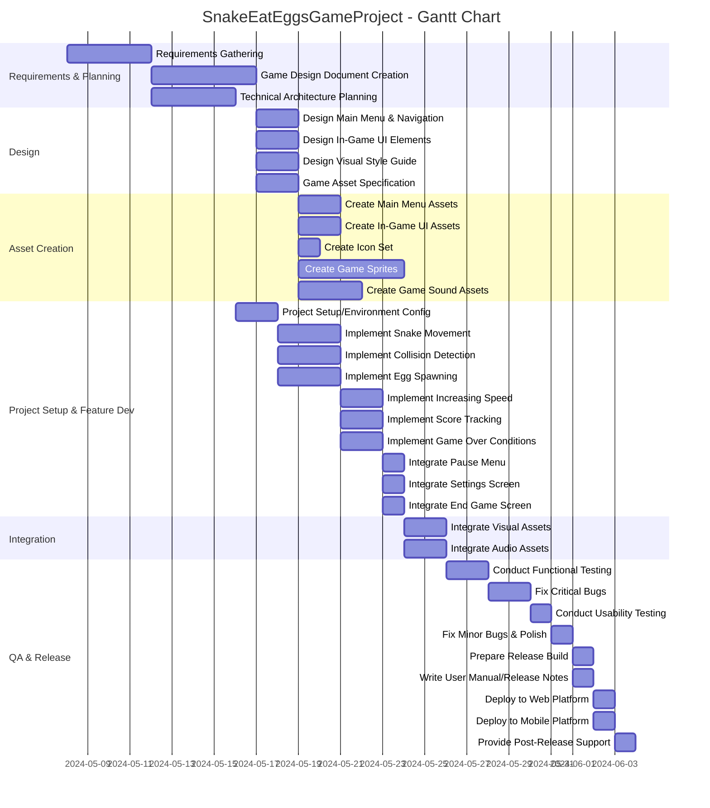

# Project Description

**Project Name**: SnakeEatEggsGameProject  
**Description**:  
This project focuses on developing the "Snake Eat Eggs" game, covering the entire lifecycle from requirements gathering and design through to development, testing, asset creation, deployment, and initial post-release support. The game will offer engaging gameplay, attractive visuals, and sound design, targeting both web and mobile platforms.

---

# Task List Table

| id    | name                                      | description                                                                                                                                      | outline_level | dependent_tasks                              | parent_task | child_tasks            | estimated_effort_in_hours | status      | required_skills                            |
|-------|-------------------------------------------|--------------------------------------------------------------------------------------------------------------------------------------------------|---------------|----------------------------------------------|-------------|------------------------|--------------------------|-------------|--------------------------------------------|
| 1     | Requirements Gathering                    | Collect and document all requirements for the Snake Eat Eggs game, including gameplay mechanics, platform, graphics, and sound.                  | 1             |                                              |             | 2, 3                  | 16                       | Not Started | Requirements Analysis, Communication        |
| 2     | Game Design Document Creation             | Create a detailed game design document covering rules, UI, levels, scoring, win/lose conditions.                                                 | 2             | 1                                            | 1           | 4a, 4b, 4c, 5          | 20                       | Not Started | Game Design, Documentation                 |
| 3     | Technical Architecture Planning           | Define technical architecture: technology stack, frameworks, tools.                                                                              | 2             | 1                                            | 1           | 6                      | 16                       | Not Started | Software Architecture, Game Development     |
| 4a    | Design Main Menu and Navigation Flow      | Design main menu layout and navigation flow.                                                                                                     | 3             | 2                                            | 2           | 7a                     | 8                        | Not Started | UI Design, UX Design                       |
| 4b    | Design In-Game UI Elements               | Design in-game UI elements: score display, pause button, overlays.                                                                               | 3             | 2                                            | 2           | 7b                     | 8                        | Not Started | UI Design, UX Design                       |
| 4c    | Design Visual Style Guide and Color Palette | Create a style guide and color palette.                                                                                                        | 3             | 2                                            | 2           | 7c                     | 8                        | Not Started | UI Design, Game Art                        |
| 5     | Game Asset Specification                 | List and specify all game assets: sprites, backgrounds, sound effects.                                                                           | 3             | 2                                            | 2           | 8, 18                  | 8                        | Not Started | Game Design, Asset Management              |
| 6     | Project Setup and Environment Configuration | Set up project repository, version control, and development environment.                                                                     | 3             | 3                                            | 3           | 9a, 9b, 9c, 10a, 10b, 10c| 8                    | Not Started | DevOps, Software Setup                     |
| 7a    | Create Main Menu Assets                  | Design and create all assets for the main menu.                                                                                                 | 4             | 4a                                           | 4a          |                        | 8                        | Not Started | Graphic Design, Game Art                   |
| 7b    | Create In-Game UI Assets                 | Design and create all in-game UI assets (score, pause, overlays).                                                                               | 4             | 4b                                           | 4b          |                        | 8                        | Not Started | Graphic Design, Game Art                   |
| 7c    | Create Icon Set                          | Design and create the icon set.                                                                                                                 | 4             | 4c                                           | 4c          |                        | 4                        | Not Started | Graphic Design, Game Art                   |
| 8     | Create Game Sprites                      | Design and create all sprites: snake, eggs, obstacles, per asset list.                                                                          | 4             | 5                                            | 5           |                        | 20                       | Not Started | Sprite Design, Game Art                    |
| 18    | Create Game Sound Assets                 | Design and create all sound effects: eating, collision, background music.                                                                       | 4             | 5                                            | 5           |                        | 12                       | Not Started | Sound Design, Audio Editing                |
| 9a    | Implement Snake Movement Logic           | Develop logic for snake movement.                                                                                                               | 4             | 6                                            | 6           |                        | 12                       | Not Started | Game Programming                           |
| 9b    | Implement Collision Detection            | Develop logic for detecting collisions.                                                                                                         | 4             | 6                                            | 6           |                        | 10                       | Not Started | Game Programming                           |
| 9c    | Implement Egg Spawning Logic             | Develop logic for spawning eggs.                                                                                                                | 4             | 6                                            | 6           |                        | 10                       | Not Started | Game Programming                           |
| 10a   | Implement Increasing Speed Feature       | Add logic for increasing the snake’s speed as game progresses.                                                                                  | 5             | 9a, 9b, 9c                                   | 6           | 11a                    | 8                        | Not Started | Game Programming                           |
| 10b   | Implement Score Tracking                 | Logic to track and display player score.                                                                                                        | 5             | 9a, 9b, 9c                                   | 6           | 11b                    | 8                        | Not Started | Game Programming                           |
| 10c   | Implement Game Over Conditions           | Logic for game over conditions.                                                                                                                 | 5             | 9a, 9b, 9c                                   | 6           | 11c                    | 8                        | Not Started | Game Programming                           |
| 11a   | Integrate Pause Menu                     | Integrate pause menu UI and logic.                                                                                                              | 6             | 10a, 7b                                      | 10a         |                        | 5                        | Not Started | UI Programming                             |
| 11b   | Integrate Settings Screen                | Integrate settings screen UI and logic.                                                                                                         | 6             | 10b, 7b                                      | 10b         |                        | 5                        | Not Started | UI Programming                             |
| 11c   | Integrate End Game Screen                | Integrate end game screen UI and logic.                                                                                                         | 6             | 10c, 7b                                      | 10c         |                        | 6                        | Not Started | UI Programming                             |
| 12    | Integrate Visual Assets                  | Integrate all created sprites and UI assets into the game.                                                                                      | 7             | 8, 7a, 7b, 7c, 10a,10b,10c,11a,11b,11c       |             | 14                     | 8                        | Not Started | Game Integration, Game Development         |
| 13    | Integrate Audio Assets                   | Integrate all sound effects and music into the game.                                                                                            | 7             | 18,10a,10b,10c,11a,11b,11c                   |             | 14                     | 8                        | Not Started | Game Integration, Game Development         |
| 14    | Conduct Functional Testing               | Conduct functional testing of the game.                                                                                                         | 8             | 12, 13                                     |             | 15                     | 8                        | Not Started | Game Testing                               |
| 15    | Fix Critical Bugs Identified             | Fix critical bugs found during functional testing.                                                                                              | 9             | 14                                           | 14          | 16                     | 8                        | Not Started | Bug Fixing                                 |
| 16    | Conduct Usability Testing                | Conduct usability testing, collect feedback.                                                                                                    | 10            | 15                                           | 15          | 17                     | 4                        | Not Started | Game Testing                               |
| 17    | Fix Minor Bugs and Polish Gameplay       | Fix minor bugs and polish gameplay based on usability testing.                                                                                   | 11            | 16                                           | 16          | 18a, 18b                | 4                        | Not Started | Bug Fixing                                 |
| 18a   | Prepare Release Build                    | Prepare the final release build for deployment.                                                                                                 | 12            | 17                                           | 17          |                        | 2                        | Not Started | Release Management                         |
| 18b   | Write User Manual and Release Notes      | Write user manual and release notes.                                                                                                            | 12            | 17                                           | 17          | 19a, 19b                | 2                        | Not Started | Documentation                              |
| 19a   | Deploy to Web Platform                   | Deploy game to the web platform.                                                                                                                | 13            | 18a, 18b                                    | 18b         | 20                     | 2                        | Not Started | Deployment                                  |
| 19b   | Deploy to Mobile Platform                | Deploy game to the mobile platform.                                                                                                             | 13            | 18a, 18b                                    | 18b         | 20                     | 2                        | Not Started | Deployment                                  |
| 20    | Provide Initial Post-Release Support     | Provide initial post-release support, address critical issues.                                                                                  | 14            | 19a, 19b                                    |             |                        | 4                        | Not Started | Customer Support                            |

---

# Task Gantt Diagram

---

**Note**:  
- Task durations in the Gantt are approximate and based on the effort estimates in the task table. They can be adjusted to reflect actual scheduling needs.
- Parallelism is shown where multiple tasks can progress after common dependencies are met.
- Some lower-level tasks (e.g., feature integration, assets, QA steps) can overlap as the project may allow flexible scheduling among disciplines.